---
# Please do not edit this file directly; it is auto generated.
# Instead, please edit 04-ggplot2.md in _episodes_rmd/
title: "Data Visualisation with ggplot2"
teaching: 80
exercises: 35
questions:
  - "What are the components of a ggplot?"
  - "How do I create scatterplots, boxplots, and barplots?"
  - "How can I change the aesthetics (ex. colour, transparency) of my plot?"
  - "How can I create multiple plots at once?"
objectives:
   - "Produce scatter plots, boxplots, and time series plots using ggplot."
   - "Set universal plot settings."
   - "Describe what faceting is and apply faceting in ggplot."
   - "Modify the aesthetics of an existing ggplot plot (including axis labels and color)."
   - "Build complex and customized plots from data in a data frame."
keypoints:
   - "`ggplot2` is a flexible and useful tool for creating plots in R."
   - "The data set and coordinate system can be defined using the `ggplot` function."
   - "Additional layers, including geoms, are added using the `+` operator."
   - "Boxplots are useful for visualizing the distribution of a continuous variable."
   - "Barplots are useful for visualizing categorical data."
   - "Faceting allows you to generate multiple plots based on a categorical variable."
---


We start by loading the required package. **`ggplot2`** is also included in the
**`tidyverse`** package.


~~~
library(tidyverse)
~~~
{: .language-r}

If not still in the workspace, load the data we saved in the previous lesson.


~~~
interviews_plotting <- read_csv("data_output/interviews_plotting.csv")
~~~
{: .language-r}


~~~
Parsed with column specification:
cols(
  .default = col_logical(),
  key_ID = col_double(),
  village = col_character(),
  interview_date = col_datetime(format = ""),
  no_membrs = col_double(),
  years_liv = col_double(),
  respondent_wall_type = col_character(),
  rooms = col_double(),
  memb_assoc = col_character(),
  affect_conflicts = col_character(),
  liv_count = col_double(),
  no_meals = col_double(),
  instanceID = col_character(),
  number_months_lack_food = col_double(),
  number_items = col_double()
)
~~~
{: .output}


~~~
See spec(...) for full column specifications.
~~~
{: .output}

## Plotting with **`ggplot2`**

**`ggplot2`** is a plotting package that makes it simple to create complex plots
from data stored in a data frame. It provides a programmatic interface for
specifying what variables to plot, how they are displayed, and general visual
properties. Therefore, we only need minimal changes if the underlying data
change or if we decide to change from a bar plot to a scatterplot. This helps in
creating publication quality plots with minimal amounts of adjustments and
tweaking.

**`ggplot2`** functions work best with data in the 'long' format, i.e., a column for every
dimension, and a row for every observation. Well-structured data will save you
lots of time when making figures with **`ggplot2`**

ggplot graphics are built step by step by adding new elements. Adding layers in
this fashion allows for extensive flexibility and customization of plots.

To build a ggplot, we will use the following basic template that can be used for different types of plots:

```
ggplot(data = <DATA>, mapping = aes(<MAPPINGS>)) +  <GEOM_FUNCTION>()
```

- use the `ggplot()` function and bind the plot to a specific data frame using
  the `data` argument


~~~
ggplot(data = interviews_plotting)
~~~
{: .language-r}

- define a mapping (using the aesthetic (`aes`) function), by selecting the variables to be plotted and specifying how to present them in the graph, e.g. as x/y positions or characteristics such as size, shape, color, etc.


~~~
ggplot(data = interviews_plotting, aes(x = no_membrs, y = number_items))
~~~
{: .language-r}

- add 'geoms' – graphical representations of the data in the plot (points,
lines, bars). **`ggplot2`** offers many different geoms; we will use some
common ones today, including:

	* `geom_point()` for scatter plots, dot plots, etc.
	* `geom_boxplot()` for, well, boxplots!
	* `geom_line()` for trend lines, time series, etc.

To add a geom to the plot use the `+` operator. Because we have two continuous variables,
let's use `geom_point()` first:


~~~
ggplot(data = interviews_plotting, aes(x = no_membrs, y = number_items)) +
    geom_point()
~~~
{: .language-r}

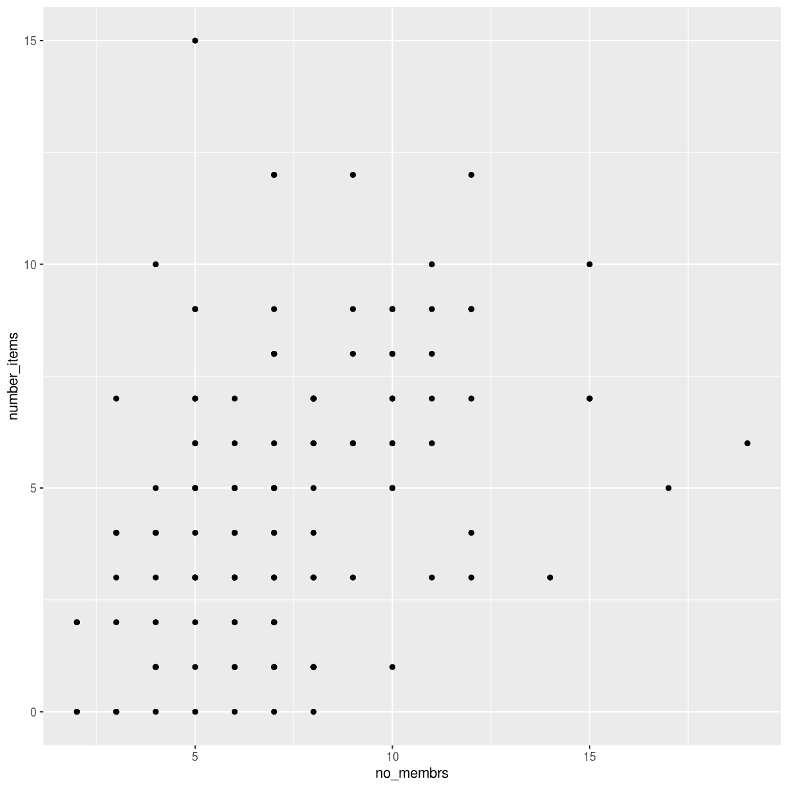

The `+` in the **`ggplot2`** package is particularly useful because it allows
you to modify existing `ggplot` objects. This means you can easily set up plot
templates and conveniently explore different types of plots, so the above plot
can also be generated with code like this:


~~~
# Assign plot to a variable
interviews_plot <- ggplot(data = interviews_plotting, aes(x = no_membrs, y = number_items))

# Draw the plot
interviews_plot +
    geom_point()
~~~
{: .language-r}

> ## Notes
>
> - Anything you put in the `ggplot()` function can be seen by any geom layers
>   that you add (i.e., these are universal plot settings). This includes the x-
>   and y-axis mapping you set up in `aes()`.
> - You can also specify mappings for a given geom independently of the mapping
>   defined globally in the `ggplot()` function.
> - The `+` sign used to add new layers must be placed at the end of the line
>   containing the *previous* layer. If, instead, the `+` sign is added at the
>   beginning of the line containing the new layer, **`ggplot2`** will not add
>   the new layer and will return an error message.
{: .callout}


~~~
## This is the correct syntax for adding layers
interviews_plot +
    geom_point()

## This will not add the new layer and will return an error message
interviews_plot
+ geom_point()
~~~
{: .language-r}

## Building your plots iteratively

Building plots with **`ggplot2`** is typically an iterative process. We start by
defining the dataset we'll use, lay out the axes, and choose a geom:


~~~
ggplot(data = interviews_plotting, aes(x = no_membrs, y = number_items)) +
    geom_point()
~~~
{: .language-r}

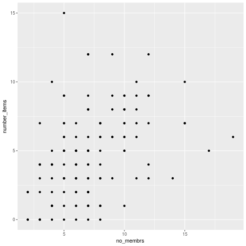

Then, we start modifying this plot to extract more information from it. For
instance, we can add transparency (`alpha`) to avoid overplotting, which means
that overlapping points become invisible. Adding transparency begins to address
this problem, as overlapping dots become darker:


~~~
ggplot(data = interviews_plotting, aes(x = no_membrs, y = number_items)) +
    geom_point(alpha = 0.5)
~~~
{: .language-r}

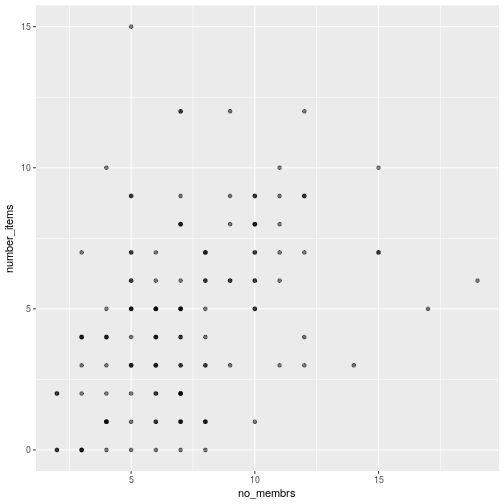

That only helped a little bit with the overplotting problem. We can also
introduce a little bit of randomness into the position of our points
using the `geom_jitter()` function.


~~~
ggplot(data = interviews_plotting, aes(x = no_membrs, y = number_items)) +
    geom_jitter(alpha = 0.5)
~~~
{: .language-r}


We can also add colors for all the points:


~~~
ggplot(data = interviews_plotting, aes(x = no_membrs, y = number_items)) +
    geom_jitter(alpha = 0.5, color = "blue")
~~~
{: .language-r}

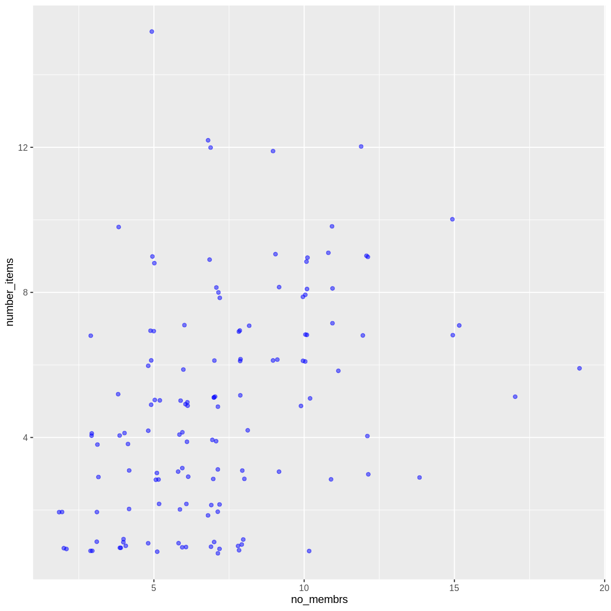

Or to color each species in the plot differently, you could use a vector as an input to the argument **`color`**.  Because we are now mapping features of the data to a color, instead of setting one color for all points, the color now needs to be set inside a call to the **`aes`** function. **`ggplot2`** will provide a different color corresponding to different values in the vector. We set the value of **`alpha`** outside of the **`aes`** function call because we are using the same value for all points. Here is an example where we color by **`village`**:


~~~
ggplot(data = interviews_plotting, aes(x = no_membrs, y = number_items)) +
    geom_jitter(aes(color = village), alpha = 0.5)
~~~
{: .language-r}

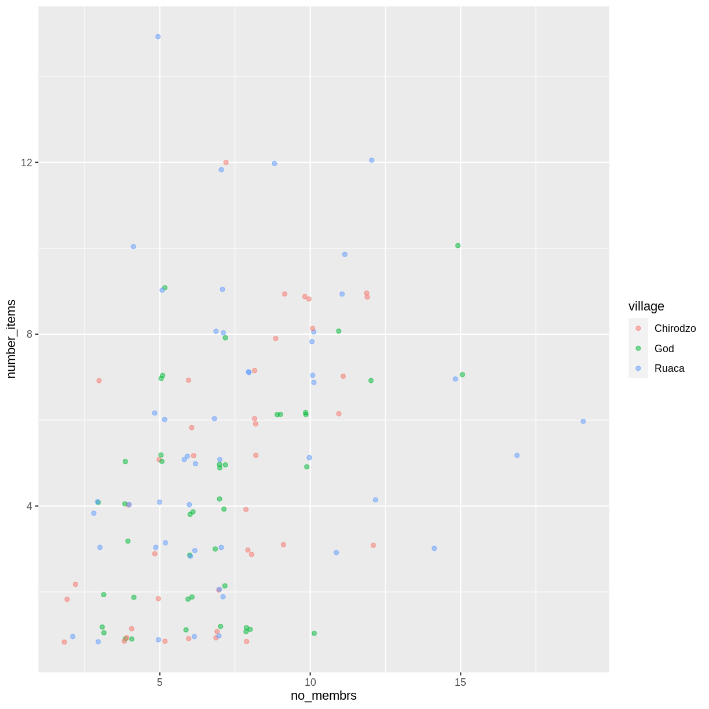

There appears to be a positive trend between number of household
members and number of items owned (from the list provided). This trend
does not appear to be different by village.

> ## Exercise
>
> Use what you just learned to create a scatter plot of `rooms` by `village`
> with the `respondent_wall_type` showing in different colors. Is this a good
> way to show this type of data?
>
> > ## Solution
> >
> > 
> > ~~~
> > ggplot(data = interviews_plotting, aes(x = village, y = rooms)) +
> > geom_jitter(aes(color = respondent_wall_type))
> > ~~~
> > {: .language-r}
> > 
> > 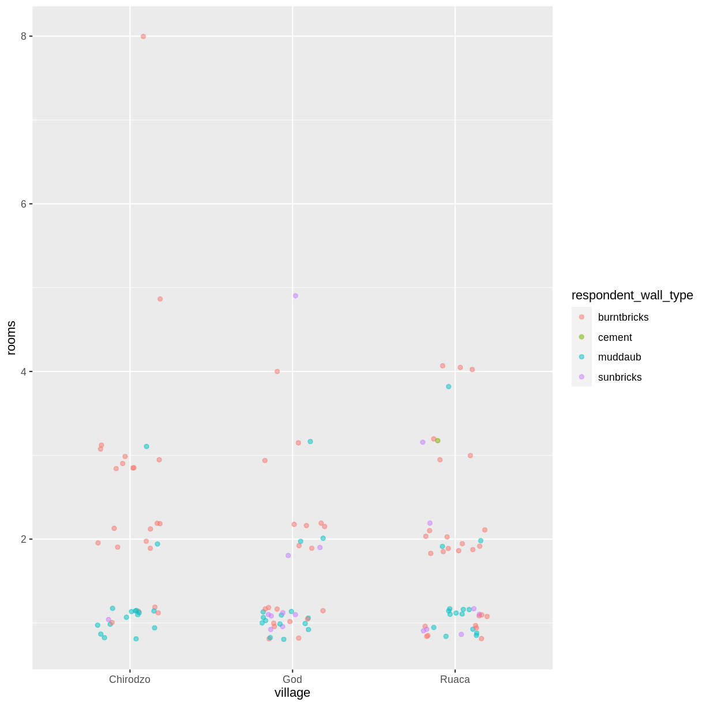
> > This is not a good way to show this type of data because it is difficult to
> > distinguish between villages.
> {: .solution}
{: .challenge}


## Boxplot

We can use boxplots to visualize the distribution of rooms for each
wall type:


~~~
ggplot(data = interviews_plotting, aes(x = respondent_wall_type, y = rooms)) +
    geom_boxplot()
~~~
{: .language-r}

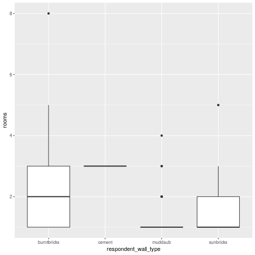

By adding points to a boxplot, we can have a better idea of the number of
measurements and of their distribution:


~~~
ggplot(data = interviews_plotting, aes(x = respondent_wall_type, y = rooms)) +
    geom_boxplot(alpha = 0) +
    geom_jitter(alpha = 0.5, color = "tomato")
~~~
{: .language-r}


We can see that muddaub houses and sunbrick houses tend to be smaller than
burntbrick houses.

Notice how the boxplot layer is behind the jitter layer? What do you need to
change in the code to put the boxplot in front of the points such that it's not
hidden?

> ## Exercise
>
> Boxplots are useful summaries, but hide the *shape* of the distribution. For
> example, if the distribution is bimodal, we would not see it in a
> boxplot. An alternative to the boxplot is the violin plot, where the shape
> (of the density of points) is drawn.
>
> - Replace the box plot with a violin plot; see `geom_violin()`.
>
> > ## Solution
> >
> > 
> > ~~~
> > ggplot(data = interviews_plotting, aes(x = respondent_wall_type, y = rooms)) +
> >   geom_violin(alpha = 0) +
> >   geom_jitter(alpha = 0.5, color = "tomato")
> > ~~~
> > {: .language-r}
> > 
> > 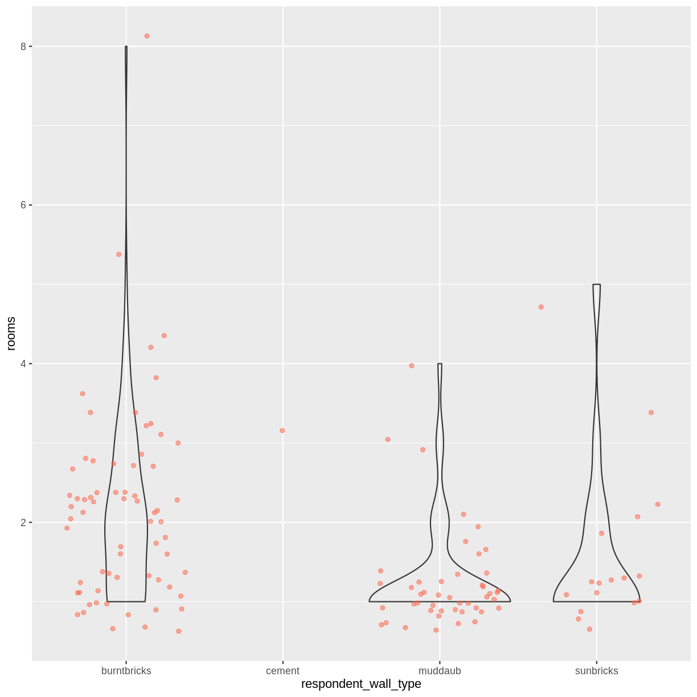
> {: .solution}
>
> So far, we've looked at the distribution of room number within wall type. Try
> making a new plot to explore the distribution of another variable within wall
> type.
>
> - Create a boxplot for `liv_count` for each wall type. Overlay the boxplot
>   layer on a jitter layer to show actual measurements.
>
> > ## Solution
> > 
> > ~~~
> > ggplot(data = interviews_plotting, aes(x = respondent_wall_type, y = liv_count)) +
> >   geom_boxplot(alpha = 0) +
> >   geom_jitter(alpha = 0.5)
> > ~~~
> > {: .language-r}
> > 
> > 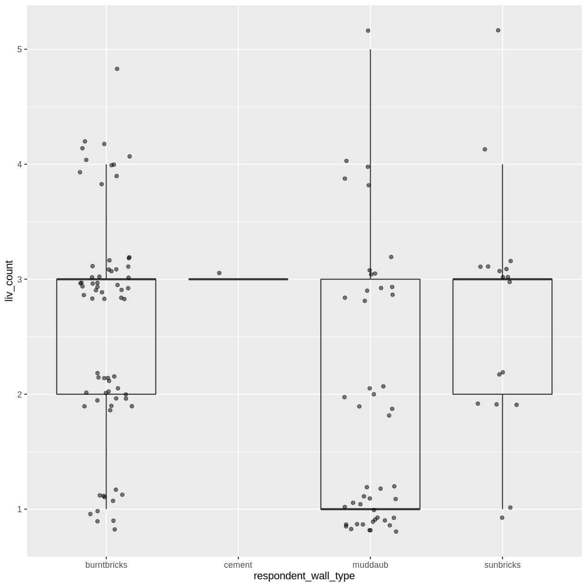
> {: .solution}
>
> - Add color to the data points on your boxplot according to whether the
>   respondent is a member of an irrigation association (`memb_assoc`).
>
> > ## Solution
> > 
> > ~~~
> > ggplot(data = interviews_plotting, aes(x = respondent_wall_type, y = liv_count)) +
> >   geom_boxplot(alpha = 0) +
> >   geom_jitter(aes(alpha = 0.5, color = memb_assoc))
> > ~~~
> > {: .language-r}
> > 
> > 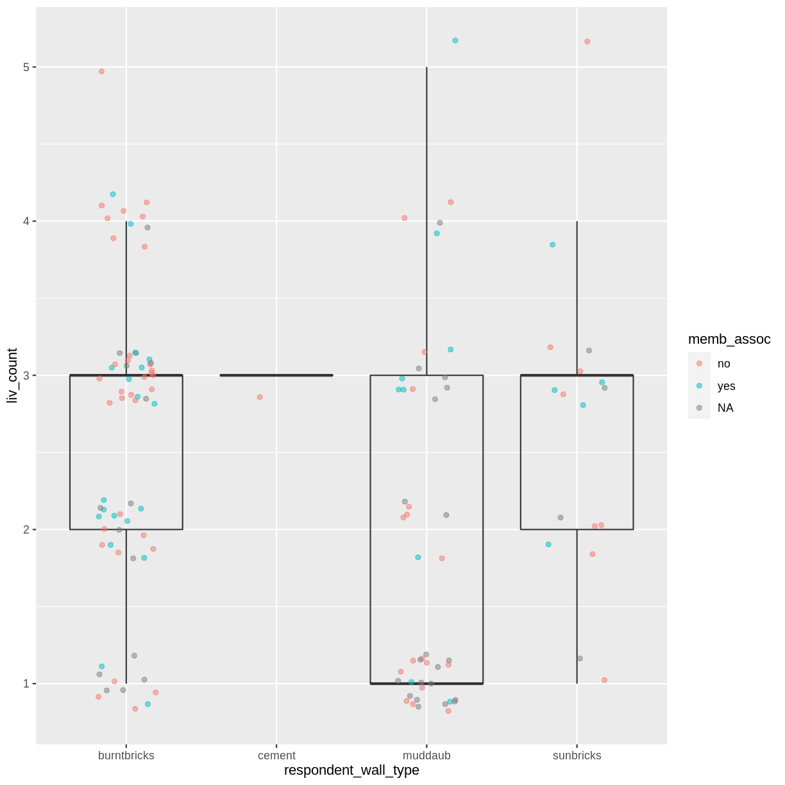
> {: .solution}
{: .challenge}

## Barplots

Barplots are also useful for visualizing categorical data. By default,
`geom_bar` accepts a variable for x, and plots the number of instances each
value of x (in this case, wall type) appears in the dataset.


~~~
ggplot(data = interviews_plotting, aes(x = respondent_wall_type)) +
    geom_bar()
~~~
{: .language-r}

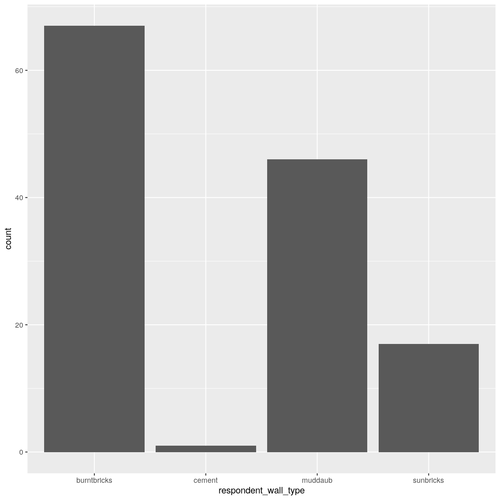

We can use the `fill` aesthetic for the `geom_bar()` geom to color bars by
the portion of each count that is from each village.


~~~
ggplot(data = interviews_plotting, aes(x = respondent_wall_type)) +
    geom_bar(aes(fill = village))
~~~
{: .language-r}

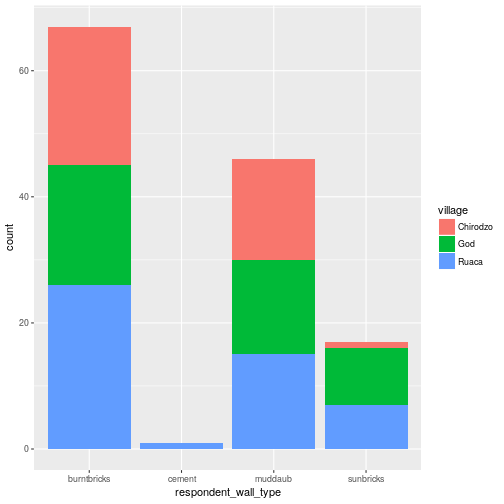

This creates a stacked bar chart. These are generally more difficult to read
than side-by-side bars. We can separate the portions of the stacked bar that
correspond to each village and put them side-by-side by using the `position`
argument for `geom_bar()` and setting it to "dodge".


~~~
ggplot(data = interviews_plotting, aes(x = respondent_wall_type)) +
    geom_bar(aes(fill = village), position = "dodge")
~~~
{: .language-r}

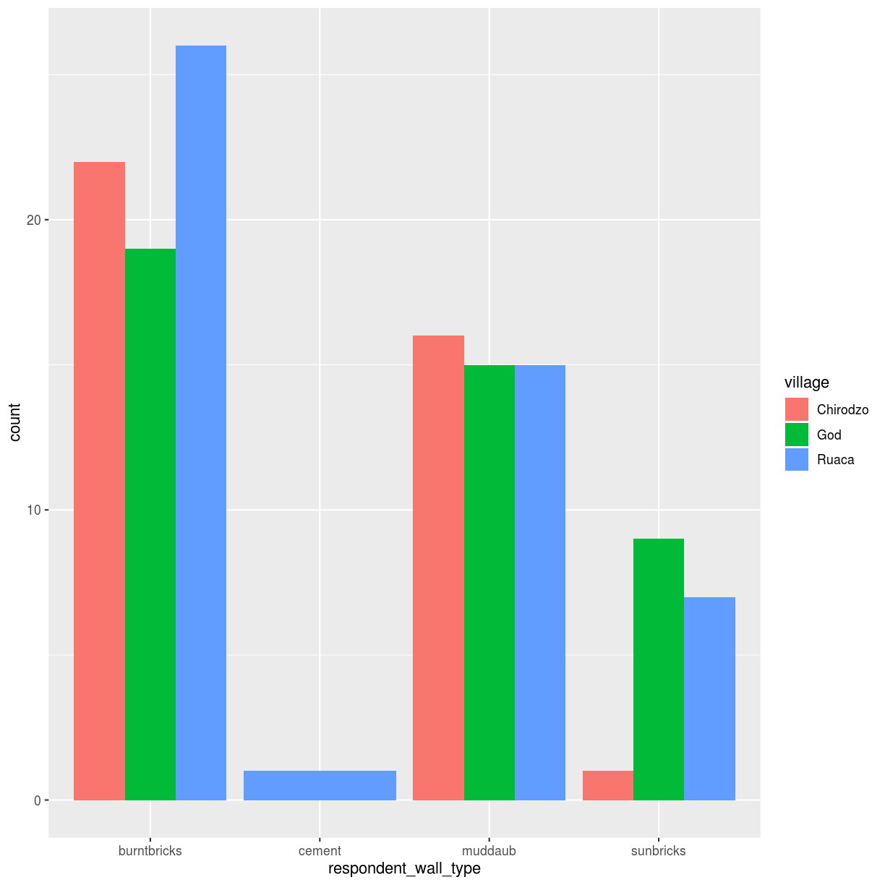

This is a nicer graphic, but we're more likely to be interested in the
proportion of each housing type in each village than in the actual count of
number of houses of each type (because we might have sampled different numbers
of households in each village). To compare proportions, we will first create a
new data frame (`percent_wall_type`) with a new column named "percent"
representing the percent of each house type in each village. We will remove
houses with cement walls, as there was only one in the dataset.


~~~
percent_wall_type <- interviews_plotting %>%
    filter(respondent_wall_type != "cement") %>%
    count(village, respondent_wall_type) %>%
    group_by(village) %>%
    mutate(percent = n / sum(n) * 100) %>%
    ungroup()
~~~
{: .language-r}

Now we can use this new data frame to create our plot showing the
percentage of each house type in each village.


~~~
 ggplot(percent_wall_type, aes(x = village, y = percent, fill = respondent_wall_type)) +
     geom_bar(stat = "identity", position = "dodge")
~~~
{: .language-r}

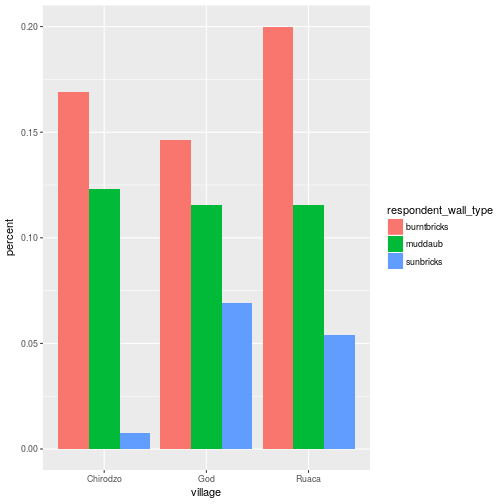

> ## Exercise
>
> Create a bar plot showing the proportion of respondents in each
> village who are or are not part of an irrigation association
> (`memb_assoc`). Include only respondents who answered that question
> in the calculations and plot. Which village had the lowest proportion of
> respondents in an irrigation association?
>
> > ## Solution
> >
> > 
> > ~~~
> > percent_memb_assoc <- interviews_plotting %>%
> >   filter(!is.na(memb_assoc)) %>%
> >   count(village, memb_assoc) %>%
> >   group_by(village) %>%
> >   mutate(percent = n / sum(n) * 100) %>%
> >   ungroup()
> > 
> > ggplot(percent_memb_assoc, aes(x = village, y = percent, fill = memb_assoc)) +
> > geom_bar(stat = "identity", position = "dodge")
> > ~~~
> > {: .language-r}
> > 
> > 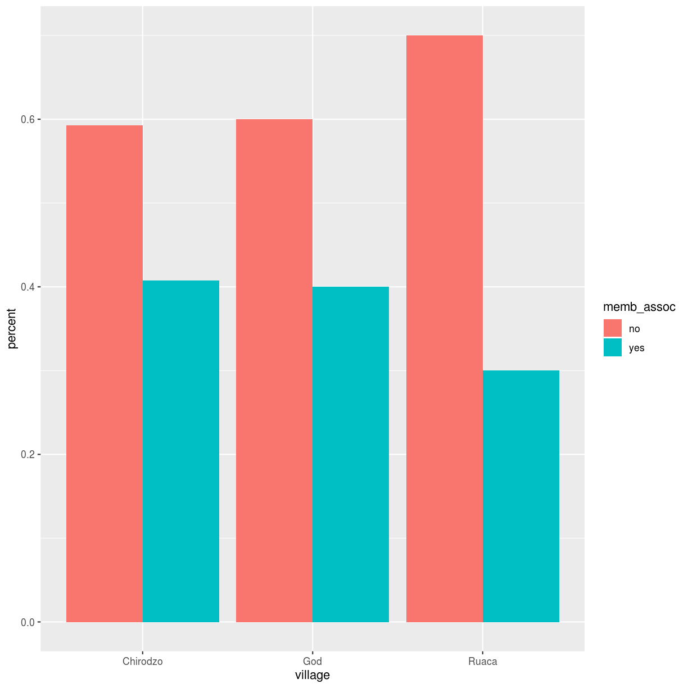
> >
> > Ruaca had the lowest proportion of members in an irrigation association.
> {: .solution}
{: .challenge}


## Adding Labels and Titles

By default, the axes labels on a plot are determined by the name of the variable
being plotted. However, **`ggplot2`** offers lots of customization options,
like specifying the axes labels, and adding a title to the plot with
relatively few lines of code. We will add more informative x and y axis
labels to our plot of proportion of house type by village and also add
a title.


~~~
ggplot(percent_wall_type, aes(x = village, y = percent, fill = respondent_wall_type)) +
    geom_bar(stat = "identity", position = "dodge") +
    labs(title="Proportion of wall type by village",
         x="Village",
         y="Percent")
~~~
{: .language-r}

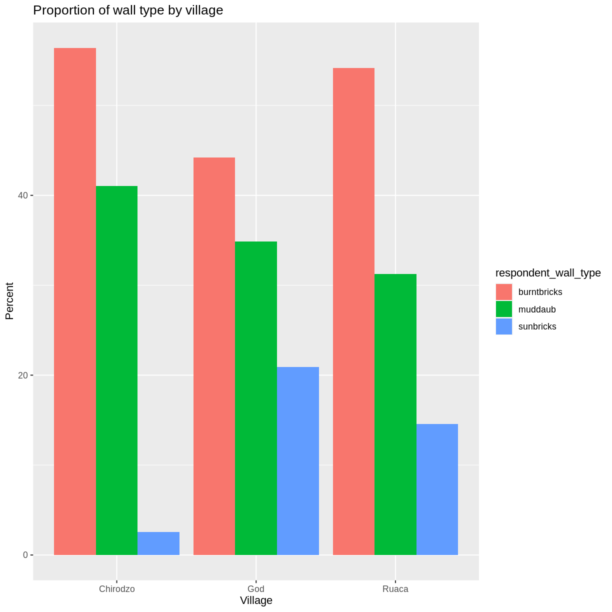

## Faceting

Rather than creating a single plot with side-by-side bars for each
village, we may want to create multiple plot, where each plot shows the
data for a single village. This would be especially useful if we had
a large number of villages that we had sampled, as a large number of
side-by-side bars will become more difficult to read.

**`ggplot2`** has a special technique called *faceting* that allows the user to split one
plot into multiple plots based on a factor included in the dataset. We
will use it to split our barplot of housing type proportion by village
so that each village has it's own panel in a multi-panel plot:


~~~
ggplot(percent_wall_type, aes(x = respondent_wall_type, y = percent)) +
    geom_bar(stat = "identity", position = "dodge") +
    labs(title="Proportion of wall type by village",
         x="Wall Type",
         y="Percent") +
    facet_wrap(~ village)
~~~
{: .language-r}

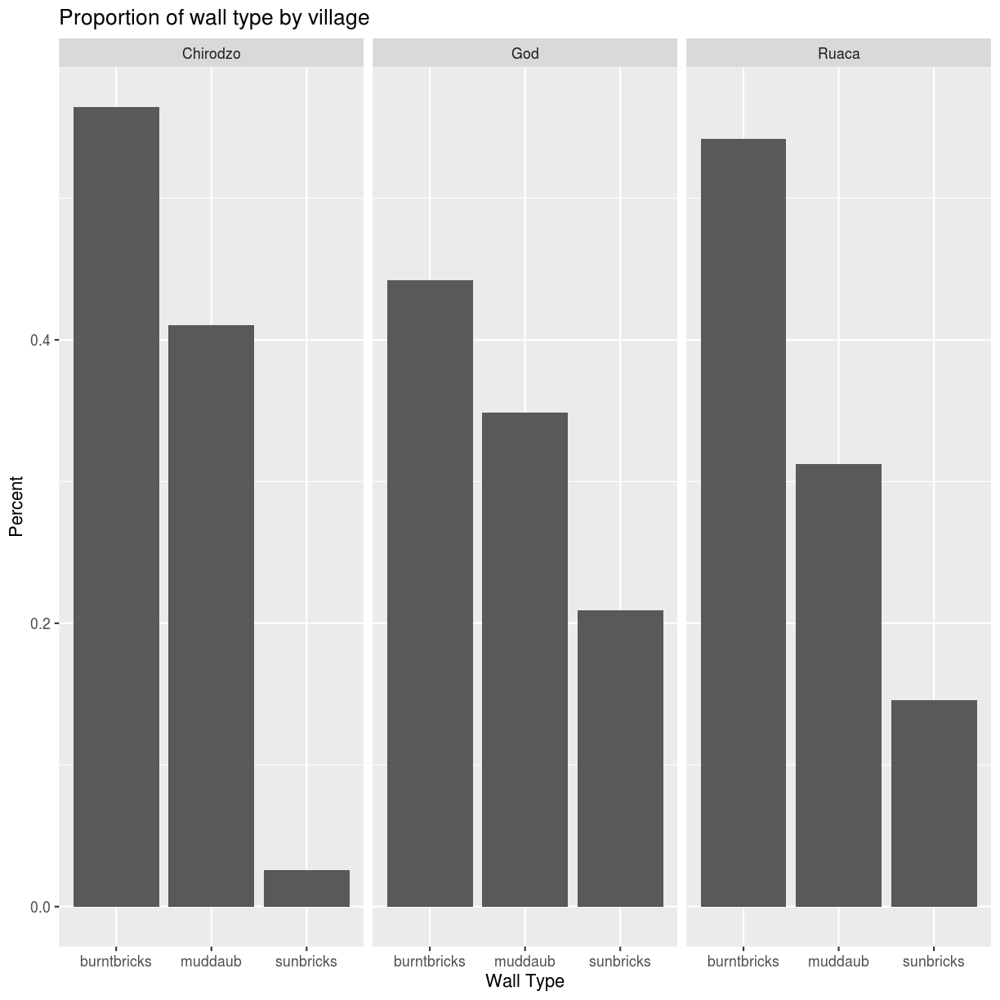

Click the "Zoom" button in your RStudio plots pane to view a larger
version of this plot.

Usually plots with white background look more readable when printed.  We can set
the background to white using the function `theme_bw()`. Additionally, you can remove
the grid:


~~~
ggplot(percent_wall_type, aes(x = respondent_wall_type, y = percent)) +
    geom_bar(stat = "identity", position = "dodge") +
    labs(title="Proportion of wall type by village",
         x="Wall Type",
         y="Percent") +
    facet_wrap(~ village) +
    theme_bw() +
    theme(panel.grid = element_blank())
~~~
{: .language-r}


What if we wanted to see the proportion of respondents in each village
who owned a particular item? We can calculate the percent of people
in each village who own each item and then create a faceted series of
bar plots where each plot is a particular item. First we need to
calculate the percentage of people in each village who own each item:


~~~
percent_items <- interviews_plotting %>%
    gather(items, items_owned_logical, bicycle:no_listed_items) %>%
    filter(items_owned_logical) %>%
    count(items, village) %>%
    ## add a column with the number of people in each village
    mutate(people_in_village = case_when(village == "Chirodzo" ~ 39,
                                         village == "God" ~ 43,
                                         village == "Ruaca" ~ 49)) %>%
    mutate(percent = n / people_in_village * 100)
~~~
{: .language-r}

To calculate this percentage data frame, we needed to use the `case_when()`
parameter within `mutate()`. In our earlier examples, we knew that each house
was one and only one of the types specified. However, people can (and do) own
more than one item, so we can't use the sum of the count column to give us the
denominator in our percentage calculation. Instead, we need to specify the
number of respondents in each village. Using this data frame, we can now create
a multi-paneled bar plot.


~~~
ggplot(percent_items, aes(x = village, y = percent)) +
    geom_bar(stat = "identity", position = "dodge") +
    facet_wrap(~ items) +
    theme_bw() +
    theme(panel.grid = element_blank())
~~~
{: .language-r}

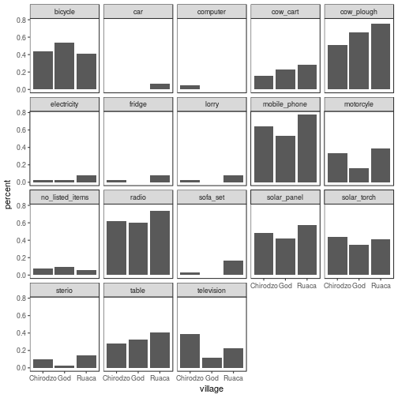

## **`ggplot2`** themes

In addition to `theme_bw()`, which changes the plot background to white,
**`ggplot2`** comes with several other themes which can be useful to quickly
change the look of your visualization. The complete list of themes is available
at <https://ggplot2.tidyverse.org/reference/ggtheme.html>. `theme_minimal()` and
`theme_light()` are popular, and `theme_void()` can be useful as a starting
point to create a new hand-crafted theme.

The
[ggthemes](https://jrnold.github.io/ggthemes/reference/index.html)
package provides a wide variety of options (including an Excel 2003 theme). The
[**`ggplot2`** extensions website](https://exts.ggplot2.tidyverse.org/) provides a list
of packages that extend the capabilities of **`ggplot2`**, including additional
themes.

> ## Exercise
>
> Experiment with at least two different themes. Build the previous plot
> using each of those themes. Which do you like best?
{: .challenge}

## Customization

Take a look at the [**`ggplot2`** cheat
sheet](https://github.com/rstudio/cheatsheets/blob/master/data-visualization-2.1.pdf),
and think of ways you could improve the plot.

Now, let's change names of axes to something more informative than 'village' and
'percent' and add a title to the figure:


~~~
ggplot(percent_items, aes(x = village, y = percent)) +
    geom_bar(stat = "identity", position = "dodge") +
    facet_wrap(~ items) +
    labs(title = "Percent of respondents in each village who owned each item",
         x = "Village",
         y = "Percent of Respondents") +
    theme_bw()
~~~
{: .language-r}

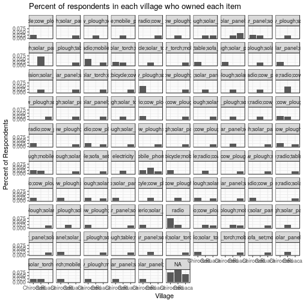

The axes have more informative names, but their readability can be improved by
increasing the font size:


~~~
ggplot(percent_items, aes(x = village, y = percent)) +
    geom_bar(stat = "identity", position = "dodge") +
    facet_wrap(~ items) +
    labs(title = "Percent of respondents in each village who owned each item",
         x = "Village",
         y = "Percent of Respondents") +
    theme_bw() +
    theme(text=element_text(size = 16))
~~~
{: .language-r}

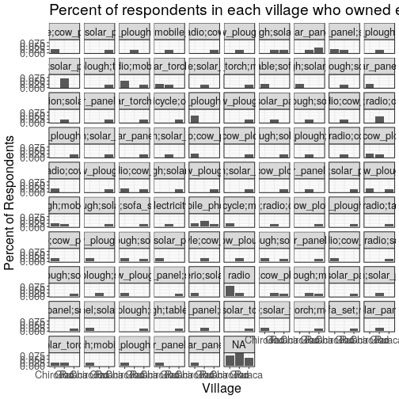

Note that it is also possible to change the fonts of your plots. If you are on
Windows, you may have to install the [**`extrafont`**
package](https://github.com/wch/extrafont), and follow the instructions included
in the README for this package.

After our manipulations, you may notice that the values on the x-axis are still
not properly readable. Let's change the orientation of the labels and adjust
them vertically and horizontally so they don't overlap. You can use a 90-degree
angle, or experiment to find the appropriate angle for diagonally oriented
labels. With a larger font, the title also runs off. We can add "\n" in the string
for the title to insert a new line:


~~~
ggplot(percent_items, aes(x = village, y = percent)) +
    geom_bar(stat = "identity", position = "dodge") +
    facet_wrap(~ items) +
    labs(title = "Percent of respondents in each village \n who owned each item",
         x = "Village",
         y = "Percent of Respondents") +
    theme_bw() +
    theme(axis.text.x = element_text(colour = "grey20", size = 12, angle = 45, hjust = 0.5, vjust = 0.5),
          axis.text.y = element_text(colour = "grey20", size = 12),
          text = element_text(size = 16))
~~~
{: .language-r}

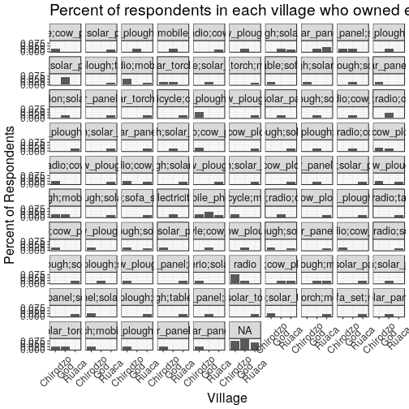

If you like the changes you created better than the default theme, you can save
them as an object to be able to easily apply them to other plots you may create.
We can also add `plot.title = element_text(hjust = 0.5)` to center the title:


~~~
grey_theme <- theme(axis.text.x = element_text(colour = "grey20", size = 12, angle = 45, hjust = 0.5, vjust = 0.5),
                    axis.text.y = element_text(colour = "grey20", size = 12),
                    text = element_text(size = 16),
                    plot.title = element_text(hjust = 0.5))


ggplot(percent_items, aes(x = village, y = percent)) +
    geom_bar(stat = "identity", position = "dodge") +
    facet_wrap(~ items) +
    labs(title = "Percent of respondents in each village \n who owned each item",
         x = "Village",
         y = "Percent of Respondents") +
    grey_theme
~~~
{: .language-r}


> ## Exercise
>
> With all of this information in hand, please take another five minutes to
> either improve one of the plots generated in this exercise or create a
> beautiful graph of your own. Use the RStudio [**`ggplot2`** cheat sheet](https://www.rstudio.com/wp-content/uploads/2016/11/ggplot2-cheatsheet-2.1.pdf)
> for inspiration. Here are some ideas:
>
> * See if you can make the bars white with black outline.
> * Try using a different color palette (see
>   [http://www.cookbook-r.com/Graphs/Colors_(ggplot2)/](http://www.cookbook-r.com/Graphs/Colors_(ggplot2)/)).
{: .challenge}

After creating your plot, you can save it to a file in your favorite format. The Export tab in the **Plot** pane in RStudio will save your plots at low resolution, which will not be accepted by many journals and will not scale well for posters.

Instead, use the `ggsave()` function, which allows you easily change the dimension and resolution of your plot by adjusting the appropriate arguments (`width`, `height` and `dpi`).

Make sure you have the `fig_output/` folder in your working directory.


~~~
my_plot <- ggplot(percent_items, aes(x = village, y = percent)) +
    geom_bar(stat = "identity", position = "dodge") +
    facet_wrap(~ items) +
    labs(title = "Percent of respondents in each village \n who owned each item",
         x = "Village",
         y = "Percent of Respondents") +
    theme_bw() +
    theme(axis.text.x = element_text(colour = "grey20", size = 12, angle = 45, hjust = 0.5, vjust = 0.5),
          axis.text.y = element_text(colour = "grey20", size = 12),
          text = element_text(size = 16),
          plot.title = element_text(hjust = 0.5))

ggsave("fig_output/name_of_file.png", my_plot, width = 15, height = 10)
~~~
{: .language-r}

Note: The parameters `width` and `height` also determine the font size in the saved plot.


