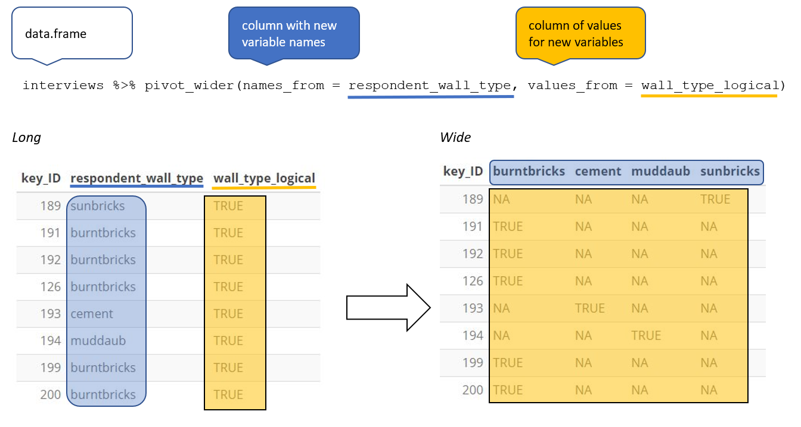
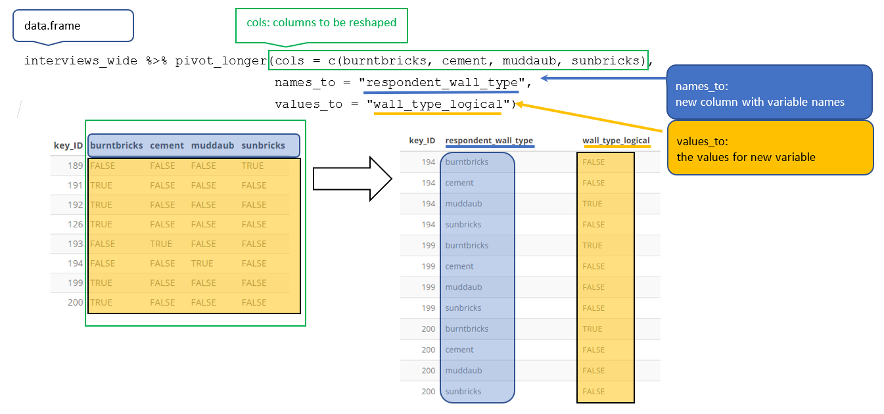

```{r, include = FALSE}
source("../bin/chunk-options.R")
knitr_fig_path("03-")
source("../bin/download_data.R")
```

**`dplyr`** is a package for making tabular data wrangling easier by using a
limited set of functions that can be combined to extract and summarize insights
from your data. It pairs nicely with **`tidyr`** which enables you to swiftly
convert between different data formats (long vs. wide) for plotting and analysis.

Similarly to **`readr`**, **`dplyr`** and **`tidyr`** are also part of the
tidyverse. These packages were loaded in R's memory when we called
`library(tidyverse)` earlier.

> ## Note
>
> The packages in the tidyverse, namely **`dplyr`**, **`tidyr`** and **`ggplot2`**
> accept both the British (e.g. *summarise*) and American (e.g. *summarize*) spelling
> variants of different function and option names. For this lesson, we utilize
> the American spellings of different functions; however, feel free to use
> the regional variant for where you are teaching.
{: .callout}

## What is an R package?

The package **`dplyr`** provides easy tools for the most common data
wrangling tasks. It is built to work directly with dataframes, with many
common tasks optimized by being written in a compiled language (C++) (not all R
packages are written in R!).

The package **`tidyr`** addresses the common problem of wanting to reshape your
data for plotting and use by different R functions. Sometimes we want data sets
where we have one row per measurement. Sometimes we want a dataframe where each
measurement type has its own column, and rows are instead more aggregated
groups. Moving back and forth between these formats is nontrivial, and
**`tidyr`** gives you tools for this and more sophisticated data wrangling.

But there are also packages available for a wide range of tasks including
building plots (**`ggplot2`**, which we'll see later), downloading data from the
NCBI database, or performing statistical analysis on your data set. Many
packages such as these are housed on, and downloadable from, the
**C**omprehensive **R** **A**rchive **N**etwork (CRAN) using `install.packages`.
This function makes the package accessible by your R installation with the
command `library()`, as you did with `tidyverse` earlier.

To easily access the documentation for a package within R or RStudio, use
`help(package = "package_name")`.

To learn more about **`dplyr`** and **`tidyr`** after the workshop, you may want
to check out this [handy data transformation with **`dplyr`** cheatsheet](https://raw.githubusercontent.com/rstudio/cheatsheets/main/data-transformation.pdf)
and this [one about **`tidyr`**](https://raw.githubusercontent.com/rstudio/cheatsheets/main/tidyr.pdf).

## Learning **`dplyr`** and **`tidyr`**

To make sure everyone will use the same dataset for this lesson, we'll read
again the SAFI dataset that we downloaded earlier.

```{r, results = 'hide', purl = FALSE, message = FALSE}

## load the tidyverse
library(tidyverse)
library(here)

interviews <- read_csv(here("data", "SAFI_clean.csv"), na = "NULL")

## inspect the data
interviews

## preview the data
# view(interviews)
```

We're going to learn some of the most common **`dplyr`** functions:

- `select()`: subset columns
- `filter()`: subset rows on conditions
- `mutate()`: create new columns by using information from other columns
- `group_by()` and `summarize()`: create summary statistics on grouped data
- `arrange()`: sort results
- `count()`: count discrete values

## Selecting columns and filtering rows

To select columns of a dataframe, use `select()`. The first argument to this
function is the dataframe (`interviews`), and the subsequent arguments are the
columns to keep, separated by commas. Alternatively, if you are selecting
columns adjacent to each other, you can use a `:` to select a range of columns,
read as "select columns from ___ to ___." You may have done something similar in 
the past using subsetting. `select()` is essentially doing the same thing as 
subsetting, using a package (`dplyr`) instead of R's base functions.

```{r, results = 'hide', purl = FALSE}
# to select columns throughout the dataframe
select(interviews, village, no_membrs, months_lack_food)
# to do the same thing with subsetting
interviews[c("village","no_membrs","months_lack_food")]
# to select a series of connected columns
select(interviews, village:respondent_wall_type)
```

To choose rows based on specific criteria, we can use the `filter()` function.
The argument after the dataframe is the condition we want our final
dataframe to adhere to (e.g. village name is Chirodzo): 

```{r, purl = FALSE}
# filters observations where village name is "Chirodzo" 
filter(interviews, village == "Chirodzo")
```

We can also specify multiple conditions within the `filter()` function. We can
combine conditions using either "and" or "or" statements. In an "and" 
statement, an observation (row) must meet **every** criteria to be included
in the resulting dataframe. To form "and" statements within dplyr, we can  pass
our desired conditions as arguments in the `filter()` function, separated by
commas:

```{r, purl=FALSE}

# filters observations with "and" operator (comma)
# output dataframe satisfies ALL specified conditions
filter(interviews, village == "Chirodzo", 
                   rooms > 1, 
                   no_meals > 2)
```

We can also form "and" statements with the `&` operator instead of commas:

```{r, purl=FALSE}
# filters observations with "&" logical operator
# output dataframe satisfies ALL specified conditions
filter(interviews, village == "Chirodzo" & 
                   rooms > 1 & 
                   no_meals > 2)
```

In an "or" statement, observations must meet *at least one* of the specified conditions. 
To form "or" statements we use the logical operator for "or," which is the vertical bar (|): 

```{r, purl=FALSE}
# filters observations with "|" logical operator
# output dataframe satisfies AT LEAST ONE of the specified conditions
filter(interviews, village == "Chirodzo" | village == "Ruaca")
```


## Pipes

What if you want to select and filter at the same time? There are three
ways to do this: use intermediate steps, nested functions, or pipes.

With intermediate steps, you create a temporary dataframe and use
that as input to the next function, like this:

```{r, purl = FALSE}
interviews2 <- filter(interviews, village == "Chirodzo")
interviews_ch <- select(interviews2, village:respondent_wall_type)
```

This is readable, but can clutter up your workspace with lots of objects that
you have to name individually. With multiple steps, that can be hard to keep
track of.

You can also nest functions (i.e. one function inside of another), like this:

```{r, purl = FALSE}
interviews_ch <- select(filter(interviews, village == "Chirodzo"),
                         village:respondent_wall_type)
```

This is handy, but can be difficult to read if too many functions are nested, as
R evaluates the expression from the inside out (in this case, filtering, then
selecting).

The last option, *pipes*, are a recent addition to R. Pipes let you take the
output of one function and send it directly to the next, which is useful when
you need to do many things to the same dataset. Pipes in R look like `%>%` and
are made available via the **`magrittr`** package, installed automatically with
**`dplyr`**. If you use RStudio, you can type the pipe with:  
- <kbd>Ctrl</kbd> + <kbd>Shift</kbd> + <kbd>M</kbd> if you have a PC or <kbd>Cmd</kbd> +
<kbd>Shift</kbd> + <kbd>M</kbd> if you have a Mac.

```{r, purl = FALSE}
interviews %>%
    filter(village == "Chirodzo") %>%
    select(village:respondent_wall_type)
```

In the above code, we use the pipe to send the `interviews` dataset first
through `filter()` to keep rows where `village` is "Chirodzo", then through
`select()` to keep only the `no_membrs` and `years_liv` columns. Since `%>%`
takes the object on its left and passes it as the first argument to the function
on its right, we don't need to explicitly include the dataframe as an argument
to the `filter()` and `select()` functions any more.

Some may find it helpful to read the pipe like the word "then". For instance,
in the above example, we take the dataframe `interviews`, *then* we `filter`
for rows with `village == "Chirodzo"`, *then* we `select` columns `no_membrs` and
`years_liv`. The **`dplyr`** functions by themselves are somewhat simple,
but by combining them into linear workflows with the pipe, we can accomplish
more complex data wrangling operations.

If we want to create a new object with this smaller version of the data, we
can assign it a new name:

```{r, purl = FALSE}
interviews_ch <- interviews %>%
    filter(village == "Chirodzo") %>%
    select(village:respondent_wall_type)

interviews_ch

```

Note that the final dataframe (`interviews_ch`) is the leftmost part of this
expression.

> ## Exercise
>
>  Using pipes, subset the `interviews` data to include interviews
> where respondents were members of an irrigation association
> (`memb_assoc`) and retain only the columns `affect_conflicts`,
> `liv_count`, and `no_meals`.
>
> > ## Solution
> >
> > ```{r}
> > interviews %>%
> >     filter(memb_assoc == "yes") %>%
> >     select(affect_conflicts, liv_count, no_meals)
> > ```
> {: .solution}
{: .challenge}

### Mutate

Frequently you'll want to create new columns based on the values in existing
columns, for example to do unit conversions, or to find the ratio of values in
two columns. For this we'll use `mutate()`.

We might be interested in the ratio of number of household members
to rooms used for sleeping (i.e. avg number of people per room):

```{r, purl = FALSE}
interviews %>%
    mutate(people_per_room = no_membrs / rooms)
```

We may be interested in investigating whether being a member of an
irrigation association had any effect on the ratio of household members
to rooms. To look at this relationship, we will first remove
data from our dataset where the respondent didn't answer the
question of whether they were a member of an irrigation association.
These cases are recorded as "NULL" in the dataset.

To remove these cases, we could insert a `filter()` in the chain:

```{r, purl = FALSE}
interviews %>%
    filter(!is.na(memb_assoc)) %>%
    mutate(people_per_room = no_membrs / rooms)
```

The `!` symbol negates the result of the `is.na()` function. Thus, if `is.na()`
returns a value of `TRUE` (because the `memb_assoc` is missing), the `!` symbol
negates this and says we only want values of `FALSE`, where `memb_assoc` **is
not** missing.

> ## Exercise
>
>  Create a new dataframe from the `interviews` data that meets the following
>  criteria: contains only the `village` column and a new column called
>  `total_meals` containing a value that is equal to the total number of meals
>  served in the household per day on average (`no_membrs` times `no_meals`).
>  Only the rows where `total_meals` is greater than 20 should be shown in the
>  final dataframe.
>
>  **Hint**: think about how the commands should be ordered to produce this data
>  frame!
>
> > ## Solution
> >
> > ``` {r}
> > interviews_total_meals <- interviews %>%
> >     mutate(total_meals = no_membrs * no_meals) %>%
> >     filter(total_meals > 20) %>%
> >     select(village, total_meals)
> > ```
> {: .solution}
{: .challenge}

### Split-apply-combine data analysis and the summarize() function

Many data analysis tasks can be approached using the *split-apply-combine*
paradigm: split the data into groups, apply some analysis to each group, and
then combine the results. **`dplyr`** makes this very easy through the use of
the `group_by()` function.


#### The `summarize()` function

`group_by()` is often used together with `summarize()`, which collapses each
group into a single-row summary of that group.  `group_by()` takes as arguments
the column names that contain the **categorical** variables for which you want
to calculate the summary statistics. So to compute the average household size by
village:

```{r, purl = FALSE}
interviews %>%
    group_by(village) %>%
    summarize(mean_no_membrs = mean(no_membrs))
```

You may also have noticed that the output from these calls doesn't run off the
screen anymore. It's one of the advantages of `tbl_df` over dataframe.

You can also group by multiple columns:

```{r, purl = FALSE}
interviews %>%
    group_by(village, memb_assoc) %>%
    summarize(mean_no_membrs = mean(no_membrs))
```

Note that the output is a grouped tibble. To obtain an ungrouped tibble, use the
`ungroup` function:

```{r, purl = FALSE}
interviews %>%
    group_by(village, memb_assoc) %>%
    summarize(mean_no_membrs = mean(no_membrs)) %>%
    ungroup()
```

When grouping both by `village` and `membr_assoc`, we see rows in our table for
respondents who did not specify whether they were a member of an irrigation
association. We can exclude those data from our table using a filter step.


```{r, purl = FALSE}
interviews %>%
    filter(!is.na(memb_assoc)) %>%
    group_by(village, memb_assoc) %>%
    summarize(mean_no_membrs = mean(no_membrs))
```

Once the data are grouped, you can also summarize multiple variables at the same
time (and not necessarily on the same variable). For instance, we could add a
column indicating the minimum household size for each village for each group
(members of an irrigation association vs not):

```{r, purl = FALSE}
interviews %>%
    filter(!is.na(memb_assoc)) %>%
    group_by(village, memb_assoc) %>%
    summarize(mean_no_membrs = mean(no_membrs),
              min_membrs = min(no_membrs))
```

It is sometimes useful to rearrange the result of a query to inspect the values.
For instance, we can sort on `min_membrs` to put the group with the smallest
household first:


```{r, purl = FALSE}
interviews %>%
    filter(!is.na(memb_assoc)) %>%
    group_by(village, memb_assoc) %>%
    summarize(mean_no_membrs = mean(no_membrs),
              min_membrs = min(no_membrs)) %>%
    arrange(min_membrs)
```

To sort in descending order, we need to add the `desc()` function. If we want to
sort the results by decreasing order of minimum household size:

```{r, purl = FALSE}
interviews %>%
    filter(!is.na(memb_assoc)) %>%
    group_by(village, memb_assoc) %>%
    summarize(mean_no_membrs = mean(no_membrs),
              min_membrs = min(no_membrs)) %>%
    arrange(desc(min_membrs))
```

#### Counting

When working with data, we often want to know the number of observations found
for each factor or combination of factors. For this task, **`dplyr`** provides
`count()`. For example, if we wanted to count the number of rows of data for
each village, we would do:

```{r, purl = FALSE}
interviews %>%
    count(village)
```

For convenience, `count()` provides the `sort` argument to get results in
decreasing order:

```{r, purl = FALSE}
interviews %>%
    count(village, sort = TRUE)
```

> ## Exercise
>
> How many households in the survey have an average of
> two meals per day? Three meals per day? Are there any other numbers
> of meals represented?
>
> > ## Solution
> >
> > ```{r}
> > interviews %>%
> >    count(no_meals)
> > ```
> {: .solution}
>
> Use `group_by()` and `summarize()` to find the mean, min, and max
> number of household members for each village. Also add the number of
> observations (hint: see `?n`).
>
> > ## Solution
> >
> > ```{r}
> > interviews %>%
> >   group_by(village) %>%
> >   summarize(
> >       mean_no_membrs = mean(no_membrs),
> >       min_no_membrs = min(no_membrs),
> >       max_no_membrs = max(no_membrs),
> >       n = n()
> >   )
> > ```
> {: .solution}
>
> What was the largest household interviewed in each month?
>
> > ## Solution
> >
> > ```{r}
> > # if not already included, add month, year, and day columns
> > library(lubridate) # load lubridate if not already loaded
> > interviews %>%
> >     mutate(month = month(interview_date),
> >            day = day(interview_date),
> >            year = year(interview_date)) %>%
> >     group_by(year, month) %>%
> >     summarize(max_no_membrs = max(no_membrs))
> > ```
> {: .solution}
{: .challenge}

## Reshaping with pivot_wider() and pivot_longer()

There are essentially three rules that define a "tidy" dataset:

1. Each variable has its own column
2. Each observation has its own row
3. Each value must have its own cell

In this section we will explore how these rules are linked to the different
data formats researchers are often interested in: "wide" and "long". This
tutorial will help you efficiently transform your data shape regardless of
original format. First we will explore qualities of the `interviews` data and
how they relate to these different types of data formats.

### Long and wide data formats

In the `interviews` data, each row contains the values of variables associated
with each record collected (each interview in the villages), where it is stated
that the `key_ID` was "added to provide a unique Id for each observation"
and the `instance_ID` "does this as well but it is not as convenient to use."

However, with some inspection, we notice that there are more than one row in the
dataset with the same `key_ID` (as seen below). However, the `instanceID`s
associated with these duplicate `key_ID`s are not the same. Thus, we should
think of `instanceID` as the unique identifier for observations!

```{r, purl = FALSE}
interviews %>%
  select(key_ID, village, interview_date, instanceID)
```

As seen in the code below, for each interview date in each village no
`instanceID`s are the same. Thus, this format is what is called a "long" data
format, where each observation occupies only one row in the dataframe.

```{r, purl = FALSE}
interviews %>%
  filter(village == "Chirodzo") %>%
  select(key_ID, village, interview_date, instanceID) %>%
  sample_n(size = 10)
```

We notice that the layout or format of the `interviews` data is in a format that
adheres to rules 1-3, where

- each column is a variable
- each row is an observation
- each value has its own cell

This is called a "long" data format. But, we notice that each column represents
a different variable. In the "longest" data format there would only be three
columns, one for the id variable, one for the observed variable, and one for the
observed value (of that variable). This data format is quite unsightly
and difficult to work with, so you will rarely see it in use.

Alternatively, in a "wide" data format we see modifications to rule 1, where
each column no longer represents a single variable. Instead, columns can
represent different levels/values of a variable. For instance, in some data you
encounter the researchers may have chosen for every survey date to be a
different column.

These may sound like dramatically different data layouts, but there are some
tools that make transitions between these layouts much simpler than you might
think! The gif below shows how these two formats relate to each other, and
gives you an idea of how we can use R to shift from one format to the other.


Long and wide dataframe layouts mainly affect readability. You may find that
visually you may prefer the "wide" format, since you can see more of the data on
the screen. However, all of the R functions we have used thus far expect for
your data to be in a "long" data format. This is because the long format is more
machine readable and is closer to the formatting of databases.

### Questions which warrant different data formats

In interviews, each row contains the values of variables associated with each
record (the unit), values such as the village of the respondent, the number
of household members, or the type of wall their house had. This format allows
for us to make comparisons across individual surveys, but what if we wanted to
look at differences in households grouped by different types of housing
construction materials?

To facilitate this comparison we would need to create a new table where each row
(the unit) was comprised of values of variables associated with housing material
(e.g. the `respondent_wall_type`). In practical terms this means the values of
the wall construction materials in `respondent_wall_type` (e.g. muddaub,
burntbricks, cement, sunbricks) would become the names of column variables and
the cells would contain values of `TRUE` or `FALSE`, for whether that house had
a wall made of that material.

Once we we've created this new table, we can explore the relationship within and
between villages. The key point here is that we are still following a tidy data
structure, but we have **reshaped** the data according to the observations of
interest.

Alternatively, if the interview dates were spread across multiple columns, and
we were interested in visualizing, within each village, how irrigation
conflicts have changed over time. This would require for the interview date to
be included in a single column rather than spread across multiple columns. Thus,
we would need to transform the column names into values of a variable.

We can do both these of transformations with two `tidyr` functions,
`pivot_wider()` and `pivot_longer()`.

### Pivoting wider

`pivot_wider()` takes three principal arguments:

1. the data
2. the *names_from* column variable whose values will become new column names.
3. the *values_from* column variable whose values will fill the new column
   variables.

Further arguments include `values_fill` which, if set, fills in missing values
with the value provided.

Let's use `pivot_wider()` to transform interviews to create new columns for each
type of wall construction material. We will make use of the pipe operator as
have done before. Because both the `names_from` and `values_from` parameters
must come from column values, we will create a dummy column (we'll name it
`wall_type_logical`) to hold the value `TRUE`, which we will then place into the
appropriate column that corresponds to the wall construction material for that
respondent. When using `mutate()` if you give a single value, it will be used
for all observations in the dataset.

For each row in our newly pivoted table, only one of the newly created wall type
columns will have a value of `TRUE`, since each house can only be made of one
wall type. The default value that `pivot_wider` uses to fill the other wall
types is `NA`.



If instead of the default value being `NA`, we wanted these values to be `FALSE`,
we can insert a default value into the `values_fill` argument. By including
`values_fill = list(wall_type_logical = FALSE)` inside `pivot_wider()`, we can
fill the remainder of the wall type columns for that row with the value `FALSE`.


```{r, purl = FALSE}
interviews_wide <- interviews %>%
    mutate(wall_type_logical = TRUE) %>%
    pivot_wider(names_from = respondent_wall_type,
                values_from = wall_type_logical,
                values_fill = list(wall_type_logical = FALSE))
```


View the `interviews_wide` dataframe and notice that there is no longer a
column titled `respondent_wall_type`. This is because there is a default
parameter in `pivot_wider()` that drops the original column. The values that
were in that column have now become columns named `muddaub`, `burntbricks`,
`sunbricks`, and `cement`. You can use `dim(interviews)` and
`dim(interviews_wide)` to see how the number of columns has changed between
the two datasets.

### Pivoting longer

The opposing situation could occur if we had been provided with data in the form
of `interviews_wide`, where the building materials are column names, but we
wish to treat them as values of a `respondent_wall_type` variable instead.

In this situation we are gathering these columns turning them into a pair
of new variables. One variable includes the column names as values, and the
other variable contains the values in each cell previously associated with the
column names. We will do this in two steps to make this process a bit clearer.

`pivot_longer()` takes four principal arguments:

1. the data
2. *cols* are the names of the columns we use to fill the a new values variable
   (or to drop).
3. the *names_to* column variable we wish to create from the *cols* provided.
4. the *values_to* column variable we wish to create and fill with values
associated with the *cols* provided.

To recreate our original dataframe, we will use the following:

1. the data - `interviews_wide`
2. a list of *cols* (columns) that are to be reshaped; these can be specified
   using a  `:` if the columns to be reshaped are in one area of the dataframe,
   or with a vector (`c()`) command if the columns are spread throughout the
   dataframe.
3. the *names_to* column will be a character string of the name the column
   these columns will be collapsed into ("respondent_wall_type").
4. the *values_to* column will be a character string of the name of the
   column the values of the collapsed columns will be inserted into
   ("wall_type_logical"). This column will be populated with values of
   `TRUE` or `FALSE`.


```{r, purl = FALSE}
interviews_long <- interviews_wide %>%
    pivot_longer(cols = burntbricks:sunbricks,
                 names_to = "respondent_wall_type",
                 values_to = "wall_type_logical")
```




This creates a dataframe with `r nrow(interviews_long)` rows (4 rows per
interview respondent). The four rows for each respondent differ only in the
value of the "respondent_wall_type" and "wall_type_logical" columns. View the
data to see what this looks like.

Only one row for each interview respondent is informative--we know that if the
house walls are made of "sunbrick" they aren't made of any other the other
materials. Therefore, it would make sense to filter our dataset to only keep
values where `wall_type_logical` is `TRUE`. Because `wall_type_logical` is
already either `TRUE` or `FALSE`, when passing the column name to `filter()`,
it will automatically already only keep rows where this column has the value
`TRUE`. We can then remove the `wall_type_logical` column.

We do all of these steps together in the next chunk of code:

```{r, purl = FALSE}
interviews_long <- interviews_wide %>%
    pivot_longer(cols = c(burntbricks, cement, muddaub, sunbricks),
                 names_to = "respondent_wall_type",
                 values_to = "wall_type_logical") %>%
    filter(wall_type_logical) %>%
    select(-wall_type_logical)
```

View both `interviews_long` and `interviews_wide` and compare their structure.

## Applying `pivot_wider()` to clean our data

Now that we've learned about `pivot_longer()` and `pivot_wider()` we're going to
put these functions to use to fix a problem with the way that our data is
structured. In the spreadsheets lesson, we learned that it's best practice to
have only a single piece of information in each cell of your spreadsheet. In
this dataset, we have several columns which contain multiple pieces of
information. For example, the `items_owned` column contains information about
whether our respondents owned a fridge, a television, etc. To make this data
easier to analyze, we will split this column and create a new column for each
item. Each cell in that column will either be `TRUE` or `FALSE` and will
indicate whether that interview respondent owned that item (similar to what
we did previously with `wall_type`).

```{r, purl = FALSE}
interviews_items_owned <- interviews %>%
  separate_rows(items_owned, sep = ";") %>%
  replace_na(list(items_owned = "no_listed_items")) %>%
  mutate(items_owned_logical = TRUE) %>%
    pivot_wider(names_from = items_owned,
                values_from = items_owned_logical,
                values_fill = list(items_owned_logical = FALSE))

nrow(interviews_items_owned)
```

There are a couple of new concepts in this code chunk, so let's walk through it
line by line. First we create a new object (`interviews_items_owned`) based on
the `interviews` dataframe.

```{r, eval = FALSE}
interviews_items_owned <- interviews %>%
```

Then we use the new function `separate_rows()` from the **`tidyr`** package to
separate the values of `items_owned` based on the presence of semi-colons (`;`).
The values of this variable were multiple items separated by semi-colons, so
this action creates a row for each item listed in a household's possession.
Thus, we end up with a long format version of the dataset, with multiple rows
for each respondent. For example, if a respondent has a television and a solar
panel, that respondent will now have two rows, one with "television" and the
other with "solar panel" in the `items_owned` column.

```{r, eval = FALSE}
separate_rows(items_owned, sep = ";") %>%
```

You may notice that one of the columns is called `´NA´`. This is because some
of the respondents did not own any of the items that was in the interviewer's
list. We can use the `replace_na()` function to change these `NA` values to
something more meaningful. The `replace_na()` function expects for you to give
it a `list()` of columns that you would like to replace the `NA` values in,
and the value that you would like to replace the `NA`s. This ends up looking
like this:

```{r, eval = FALSE}
replace_na(list(items_owned = "no_listed_items")) %>%
```

Next, we create a new variable named `items_owned_logical`, which has one value
(`TRUE`) for every row. This makes sense, since each item in every row was owned
by that household. We are constructing this variable so that when spread the
`items_owned` across multiple columns, we can fill the values of those columns
with logical values describing whether the household did (`TRUE`) or didn't
(`FALSE`) own that particular item.  

```{r, eval = FALSE}
mutate(items_owned_logical = TRUE) %>%
```

Lastly, we use `pivot_wider()` to switch from long format to wide format. This
creates a new column for each of the unique values in the `items_owned` column,
and fills those columns with the values of `items_owned_logical`. We also
declare that for items that are missing, we want to fill those cells with the
value of `FALSE` instead of `NA`.

```{r, eval = FALSE}
pivot_wider(names_from = items_owned,
            values_from = items_owned_logical,
            values_fill = list(items_owned_logical = FALSE))

```

View the `interviews_items_owned` dataframe. It should have
`r nrow(interviews)` rows (the same number of rows you had originally), but
extra columns for each item. How many columns were added?

This format of the data allows us to do interesting things, like make a table
showing the number of respondents in each village who owned a particular item:

```{r, purl = FALSE}
interviews_items_owned %>%
  filter(bicycle) %>%
  group_by(village) %>%
  count(bicycle)
```

Or below we calculate the average number of items from the list owned by
respondents in each village. This code uses the `rowSums()` function to count
the number of `TRUE` values in the `bicycle` to `car` columns for each row,
hence its name. We then group the data by villages and calculate the mean
number of items, so each average is grouped by village.

```{r, purl = FALSE}
interviews_items_owned %>%
    mutate(number_items = rowSums(select(., bicycle:car))) %>%
    group_by(village) %>%
    summarize(mean_items = mean(number_items))
```

> ## Exercise
>
> 1. Create a new dataframe (named `interviews_months_lack_food`) that has one
> column for each month and records `TRUE` or `FALSE` for whether each interview
> respondent was lacking food in that month.
>
> > ## Solution
> >
> > ```{r}
> > interviews_months_lack_food <- interviews %>%
> >   separate_rows(months_lack_food, sep = ";") %>%
> >   mutate(months_lack_food_logical  = TRUE) %>%
> >   pivot_wider(names_from = months_lack_food,
> >               values_from = months_lack_food_logical,
> >               values_fill = list(months_lack_food_logical = FALSE))
> > ```
> {: .solution}
>
> 2. How many months (on average) were respondents without food if
> they did belong to an irrigation association? What about if they didn't?
>
> > ## Solution
> >
> > ```{r}
> > interviews_months_lack_food %>%
> >   mutate(number_months = rowSums(select(., Jan:May))) %>%
> >   group_by(memb_assoc) %>%
> >   summarize(mean_months = mean(number_months))
> > ```
> {: .solution}
{: .challenge}

## Exporting data

Now that you have learned how to use **`dplyr`** to extract information from
or summarize your raw data, you may want to export these new data sets to share
them with your collaborators or for archival.

Similar to the `read_csv()` function used for reading CSV files into R, there is
a `write_csv()` function that generates CSV files from dataframes.

Before using `write_csv()`, we are going to create a new folder, `data_output`,
in our working directory that will store this generated dataset. We don't want
to write generated datasets in the same directory as our raw data. It's good
practice to keep them separate. The `data` folder should only contain the raw,
unaltered data, and should be left alone to make sure we don't delete or modify
it. In contrast, our script will generate the contents of the `data_output`
directory, so even if the files it contains are deleted, we can always
re-generate them.

In preparation for our next lesson on plotting, we are going to create a version
of the dataset where each of the columns includes only one data value. To do
this, we will use `pivot_wider` to expand the `months_lack_food` and
`items_owned` columns. We will also create a couple of summary columns.


```{r, purl = FALSE}
interviews_plotting <- interviews %>%
  ## pivot wider by items_owned
  separate_rows(items_owned, sep = ";") %>%
  ## if there were no items listed, changing NA to no_listed_items
  replace_na(list(items_owned = "no_listed_items")) %>%
  mutate(items_owned_logical = TRUE) %>%
  pivot_wider(names_from = items_owned,
              values_from = items_owned_logical,
              values_fill = list(items_owned_logical = FALSE)) %>%
  ## pivot wider by months_lack_food
  separate_rows(months_lack_food, sep = ";") %>%
  mutate(months_lack_food_logical = TRUE) %>%
  pivot_wider(names_from = months_lack_food,
              values_from = months_lack_food_logical,
              values_fill = list(months_lack_food_logical = FALSE)) %>%
  ## add some summary columns
  mutate(number_months_lack_food = rowSums(select(., Jan:May))) %>%
  mutate(number_items = rowSums(select(., bicycle:car)))
```

Now we can save this dataframe to our `data_output` directory.

```{r, purl = FALSE, eval = FALSE}
write_csv (interviews_plotting, file = "data_output/interviews_plotting.csv")
```

```{r, purl = FALSE, eval = TRUE, echo = FALSE}
if (!dir.exists("data_output")) dir.create("data_output")
write_csv(interviews_plotting, "data_output/interviews_plotting.csv")
```


