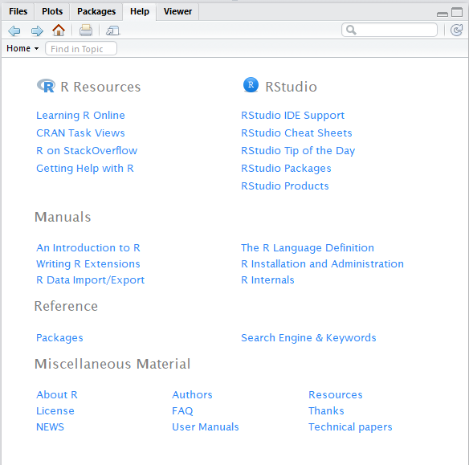

## R and RStudio

R is an open source programming language originally designed and implemented by statisticians for statistical analysis. It includes high quality graphics capabilities and tools for basic data analysis and reading and writing data to/from files.
R has a very large selection of free 3rd party add-on libraries which can be easily added to the core R system making even more analysis techniques available because it is open source and supported by a large community of developers and users.  
R is a scripted language. Rather than pointing and clicking in a GUI environment, you write code statements to ask R to perform tasks for you. This is advantageous becuase it provides a permanent record of what was done and allows for peer review of the work.
Having this written record, something which is increasingly required as part of a publication submission, is also an aid when seeking help with problems. 
There are many online resources, such as [stackoverflow ]( https://stackoverflow.com/questions/tagged/r),  which will allow you to seek help from the online R community. You can search in the normal Internet way of doing things by providing keywords in a free format search request, but you can also post specific questions. Questions supported by code snippets are more likely to attract knowledgeable responses.
Although R is a scripted language, there is still a place for the GUI (Graphical User Interface). The most popular R GUI is currently RStudio. We will be using RStudio throughout this lesson. RStudio is only the front-end interface to the R environment. In order to use RStudio, we must also install R.
In the remainder of this episode we will go through the steps of first installing R, then RStudio, and finish with a brief tour of some of the RStudio facilities.

## Installing R
The latest version of R can be downloaded from [The Comprehensive R Archive Network]( https://cran.r-project.org/). On this page, you will find download links for Linux, Mac, and Windows versions of R. You should choose the environment link appropriate to your machine's operating system. In each case, you will be guided through to a particular download for your machine. 
Having completed the download, you should install using the normal technique for your operating environment. If you are using a Windows machine you can double click the downloaded executable file.  You can default all of the prompts presented by the install wizard. By default both the 32 and 64 bit versions of R will be installed and icons for them will be available on your desktop.
These icons are shortcuts for a simple R GUI called RGui. RGui will allow you to create and run R Scripts among other things, but it is not as sophisticated as RStudio. 
## Installing RStudio
The latest version of RStudio can be downloaded from the [RStudio.com]( https://www.rstudio.com/) website.
Like R installations, there are versions for Mac, Linux and Windows. Select the one appropriate for your machine, download the file and install it. You can accept the defaults for all of the options presented by the install wizard.

In the latest versions of Windows, RStudio is not automatically placed on the desktop. To start RStudio in Windows, type ‘RStudio’ into the search bar next to the Windows Start icon in the bottom left hand corner of the screen. When the desktop app appears in the list of programs you can run it directly by selecting it or you can choose to have the icon added to the Start menu or taskbar. 

## A tour of RStudio
When you first open RStudio you will be presented with a display similar to this;

On the Righthand side there are two tabbed panes. The Hisotry tab in the right-top pane allows you to see either a history of all of the commands which have been run previously (it even remembers across sessions).  You can select any command and have it copied across into the console area on the left from where you can run it again by hitting the enter key. The Environment tab allows you to see all of the variables which exist in your current session. You can see the variable names, see what data types they are and see some of the values.  This can be useful for a quick check on variable contents. There are a set of R commands which you can run from the console to provide more complete information. The Hisotry tab in the top pane allows you to see either a history of all of the commands which have been run previously (it even remembers across sessions).  You can select any command and have it copied across into the console area on the left from where you can run it again by hitting the enter key. 

The bottom pane on the right has five tabs. 
The Files tab displays the contents of the current working directory. The default current working directory in Windows is the Documents folder.  You can change it from the menu items for the tab, or more likely it will change when you create a project with its own folder as we will be doing later. 
The Plots tab will display any graphic output you ask R to produce. There are forward and back buttons allowing you to see previous plots from the session and there are options to export the graphic to an external file.
The Packages tab is a list of all of the packages installed in your R environment and an indication of whether they are currently loaded in your RStudio session. There are options for installing additional packages from CRAN or updating existing packages. Both of which will require you to have an Internet connection.
The Viewer tab is used to display HTML files.
The Help tab provides a set of links to a variety of Help related topics. 

These links include basic manuals on R  as well as reference materials on the installed packages. The RStudio Cheat Sheets are small pdf documents which can be downloaded and provide summary information on how to use key packages in R, like dplyr and ggplot2, both of which we will be using extensively in this lesson.
In the toolbar there is a search text box where you can type what you are looking for.
### Creating a Script file
In order to follow along with the examples in this episode, you should start RStudio and create a new RScript file either from the File menu, File > New File > RScript, or the left most toolbar icon immediately below it.

If you intend to save the script you may wish to name it. If you click the save icon on the toolbar a standard save as dialog will appear.

Although we will routinely refer to using the console in this episode, and you can in fact type all of the code directly into the console, we will assume that you will write all of your code in the script file first and then select the code and either click the `run` button on the toolbar or use the keyboard shortcut of `ctrl+Enter`.

There are shortcut alternatives to many of the RStudio menu and toolbar items. The RStudio article [Editing and Executing Code](https://support.rstudio.com/hc/en-us/articles/200484448-Editing-and-Executing-Code) explains many of them.

When you select code for execution be careful that you either select the whole line or lines. If you are just running a single line, simply place the cursor in the line. If you select part of a line, then only that part will be executed.

##Installing additional packages using the packages tab
In addition to the core R installation, there are in excess of 10,000 additional packages which can be used to extend the functionality of R. Many of these packages have been written by R users and have been made available in central repositories, like the one hosted at CRAN for anyone to download and install into their own R environment. In the course of this lesson, we will be making use of several of these packages.  For instnce, ggplot2 and dplyr. 
Additional packages can be installed from the ‘packages’ tab.
On the packages tab click the ‘Install’ icon and start typing the name of the package you want in the text box. As you type, packages matching your starting characters will be displayed in a drop down list from where they can be selected.

There is a check box for ‘Install’ dependencies at the bottom of the Install Packages window. This is ticked by default, which is usually what you want. Packages can (and do) make use of functionality built into other packages, so for the functionality contained in the package you are installing to work properly, there may be other packages which have to be installed with them. The ‘Install dependencies’ option makes sure that this happens.

> ## Exercise
> Use the install option from the packages tab to install the package ‘tidyverse’
> 
> 
> > ## Solution
> > From the packages tab, click ‘Install’ from the toolbar and type ‘tidyverse’ into the textbox then click ‘install’
> > The ‘tidyverse’ package is really a package of packages, including ggplot2 and dplyr, both of which require other packages to run correctly. All of these packages will be installed automatically. 
> > Depending on what packages have previously been installed in your R environment, the install of ‘tidyverse’ could be very quick or could take several minutes.
> > As the install proceeds messages relating to the progress will be written to the console. You will be able to see all of the packages which are actually being installed.
> {: .solution}
{: .challenge}
The install process accesses the repository at CRAN, and therefoe you will need an Internet connection to install packages in this way.
It is also possible to install packages from other repositories as well as Github or the local file system, but we won’t be looking at these options in this lesson.

## Installing additional packages using R code
If you were watching the console window when you starting the install of ‘tidyverse’ you may have noticed that before the start of the installation messages, the line

~~~
install.packages("tidyverse")
~~~

was written to the console. 
This is standard R code. the function ‘install.packages’ is called and passed a single parameter.  That parameter is the name of the package you want to install.
Rather than using the Rstudio GUI functionality, you can simply write the code yourself in the console or include it as part of a script.
