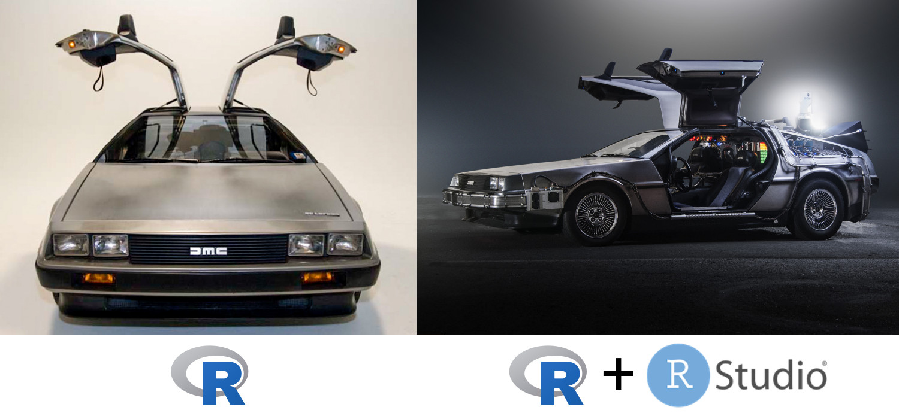

```{r, include=FALSE}
source("../bin/chunk-options.R")
knitr_fig_path("00-")
```

## R and RStudio

R is an open source programming language originally designed and implemented by
statisticians primarily for statistical analysis. It includes high quality
graphics capabilities and tools for data analysis and reading and writing data
to/from files.

Because R is open source and is supported by a large community of developers and
users there is a very large selection of third-party add-on packages which are
freely available to extend R's native capabilities.

R is a scripted language. Rather than pointing and clicking in a graphical
environment you write code statements to ask R to do something for you. This has
the advantage of providing a record of what was done and allows for peer review
of the work undertaken.

Having this written record, something which is increasingly required as part of
a publication submission, is also an aid when seeking help with problems.

There are many online resources such as
[stackoverflow](https://stackoverflow.com/questions/tagged/r) and the [RStudio
Community](https://community.rstudio.com/) which will allow you to seek help
from peers. Questions which are backed up with [short, reproducible code
snippets](https://www.tidyverse.org/help/) are more likely to attract knowledgeable responses.

To make it easier to interact with R, we will use RStudio. RStudio is the most popular IDE (Integrated Development Interface), to work with R. An IDE is a software that provide tools to make it easier to program. 

<figure>
```{r rstudio-analogy, echo=FALSE, fig.cap="RStudio extends what R can do, and make it easier to write R code and interact with R."}	

```
<figcaption>
RStudio extends what R can do, and make it easier to write R code and interact
with R. [Credit photo left
photo](https://commons.wikimedia.org/w/index.php?curid=2447462), [Credit photo right
photo](https://commons.wikimedia.org/w/index.php?curid=44599363)
</figcaption>
</figure>

## A tour of RStudio


## Knowing your way around RStudio

Let's start by learning about [RStudio](https://www.rstudio.com/), which is an
Integrated Development Environment (IDE) for working with R.

The RStudio IDE open-source product is free under the
[Affero General Public License (AGPL) v3](https://www.gnu.org/licenses/agpl-3.0.en.html).
The RStudio IDE is also available with a commercial license and priority email
support from RStudio, Inc.

We will use RStudio IDE to write code, navigate the files on our computer,
inspect the variables we are going to create, and visualize the plots we will
generate. RStudio can also be used for other things (e.g., version control,
developing packages, writing Shiny apps) that we will not cover during the
workshop.


## Getting set up

It is good practice to keep a set of related data, analyses, and text
self-contained in a single folder, called the **working directory**. All of the
scripts within this folder can then use *relative paths* to files that indicate
where inside the project a file is located (as opposed to absolute paths, which
point to where a file is on a specific computer). Working this way makes it
a lot easier to move your project around on your computer and share it with
others without worrying about whether or not the underlying scripts will still
work.

RStudio provides a helpful set of tools to do this through its "Projects"
interface, which not only creates a working directory for you but also remembers
its location (allowing you to quickly navigate to it) and optionally preserves
custom settings and open files to make it easier to resume work after a
break. Below, we will go through the steps for creating an "R Project" for this
tutorial. First let's take a quick tour of RStudio.


RStudio is divided into 4 "Panes": the **Source** for your scripts and documents
(top-left, in the default layout), the R **Console** (bottom-left), your
**Environment/History** (top-right), and your
**Files/Plots/Packages/Help/Viewer** (bottom-right). The placement of these
panes and their content can be customized (see menu, Tools -> Global Options ->
Pane Layout). One of the advantages of using RStudio is that all the information
you need to write code is available in a single window. Additionally, with many
shortcuts, autocompletion, and highlighting for the major file types you use
while developing in R, RStudio will make typing easier and less error-prone.


RStudio is divided into 4 "Panes": the **Source** for your scripts and documents
(top-left, in the default layout), the R **Console** (bottom-left), your
**Environment/History** (top-right), and your
**Files/Plots/Packages/Help/Viewer** (bottom-right). The placement of these
panes and their content can be customized (see menu, Tools -> Global Options ->
Pane Layout). One of the advantages of using RStudio is that all the information
you need to write code is available in a single window. Additionally, with many
shortcuts, autocompletion, and highlighting for the major file types you use
while developing in R, RStudio will make typing easier and less error-prone.


### Create a new project

* Under the `File` menu, click on `New project`, choose `New directory`, then
  `New project`
* Enter a name for this new folder (or "directory"), and choose a convenient
  location for it. This will be your **working directory** for the rest of the
  day (e.g., `~/data-carpentry`)
* Click on `Create project`
* Create a new file where we will type our scripts. Go to File > New File > R
script. Click the save icon on your toolbar and save your script as
"datacarpentry-workshop.R".

### Organizing your working directory

Using a consistent folder structure across your projects will help keep things
organized, and will also make it easy to find/file things in the future. This
can be especially helpful when you have multiple projects. In general, you may
create directories (folders) for **scripts**, **data**, and **documents**.

 - **`data/`** Use this folder to store your raw data and intermediate datasets
   you may create for the need of a particular analysis. For the sake of
   transparency and [provenance](https://en.wikipedia.org/wiki/Provenance), you
   should *always* keep a copy of your raw data accessible and do as much of
   your data cleanup and preprocessing programmatically (i.e., with scripts,
   rather than manually) as possible. Separating raw data from processed data is
   also a good idea. For example, you could have files
   `data/raw/irrigation__survey.plot1.txt` and `...plot2.txt` kept separate from
   a `data/processed/irrigation_survey.csv` file generated by the
   `scripts/01_preprocess_irrigation_survey.R` script.
 - **`documents/`** This would be a place to keep outlines, drafts, and other
   text.
 - **`scripts/`** This would be the location to keep your R scripts for
   different analyses or plotting.

You may want additional directories or subdirectories depending on your project
needs, but these should form the backbone of your working directory.


### The working directory

The working directory is an important concept to understand. It is the place
from where R will be looking for and saving the files. When you write code for
your project, it should refer to files in relation to the root of your working
directory and only need files within this structure.

Using RStudio projects makes this easy and ensures that your working directory
is set properly. If you need to check it, you can use `getwd()`. If for some
reason your working directory is not what it should be, you can change it in the
RStudio interface by navigating in the file browser where your working directory
should be, and clicking on the blue gear icon "More", and select "Set As Working
Directory". Alternatively you can use `setwd("/path/to/working/directory")` to
reset your working directory. However, your scripts should not include this line
because it will fail on someone else's computer.


### Working with script files

Although we will routinely refer to using the console in this episode, and you
can in fact type all of the code directly into the console, we will assume that
you will write all of your code to the script file first and then select the
code and either click the 'run' button on the toolbar or use the keyboard
shortcut of 'ctrl+Enter' (or 'command+Enter' on Mac).

There are shortcut alternatives to many of the RStudio menu and toolbar items.
The RStudio article [Editing and Executing
Code](https://support.rstudio.com/hc/en-us/articles/200484448-Editing-and-Executing-Code)
explains many of them.

When you select code for execution be careful that you either select the whole
line or lines. If you are running a single line, place the cursor on the line
you want to evaluate. If you select only a portion of a line, only that will be
run.

### Downloading the data


## Installing additional packages using the packages tab

In addition to the core R installation there are in excess of
10,000 additional packages which can be used to extend the
functionality of R. Many of these have been written by R users and
have been made available in central repositories, like the one
hosted at CRAN for anyone to download and install into their own R
environment. In the course of this lesson we will be making use of
several of these packages such as 'ggplot2' and 'dplyr'.

Additional packages can be installed from the ‘packages’ tab.
On the packages tab click the ‘Install’ icon and start typing the
name of the package you want in the text box. As you type packages
matching your starting characters will be displayed in a drop down
list from where it can be selected.


At the bottom of the Install Packages window is a check box for
‘Install’ dependencies. This is ticked by default, which is usually
what you want. Packages can (and do) make use of functionality
built into other packages, so for the functionality contained in
the package you are installing to work properly, there may be other
packages which have to be installed with them. The ‘Install
dependencies’ option makes sure that this happens.

> ## Exercise
> Use the install option from the packages tab to install the ‘tidyverse’ package.
> 
> > ## Solution
> > From the packages tab, click ‘Install’ from the toolbar and type ‘tidyverse’ into the textbox then click ‘install’
> > The ‘tidyverse’ package is really a package of packages, including 'ggplot2' and 'dplyr', both of which require other packages to run correctly. All of these packages will be installed automatically. 
> > Depending on what packages have previously been installed in your R environment, the install of ‘tidyverse’ could be very quick or could take several minutes.
> > As the install proceeds messages relating to the progress will be written to the console. You will be able to see all of the packages which are actually being installed.
> {: .solution}
{: .challenge}

Because the install process accesses the repository at CRAN, you
will need an Internet connection to install packages in this way.

It is also possible to install packages from other repositories as
well as Github or the local file system, but we won’t be looking at these options in this lesson.

## Installing additional packages using R code

If you were watching the console window when you starting the
install of ‘tidyverse’ you may have noticed that before the start
of the installation messages, the line

```{r, eval = FALSE}
install.packages("tidyverse")
```

was written to the console. 

This is standard R code. The function `install.packages()` is
called and passed a single parameter, which is the name of the
package you want to install. Rather than using the Rstudio GUI
functionality, you can write the code yourself in the console or
include it as part of a script.
