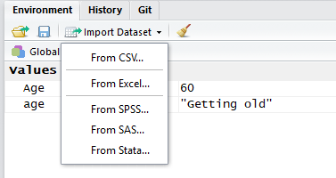
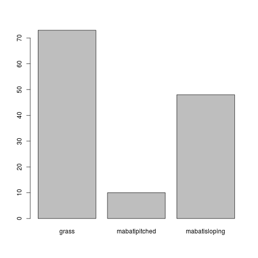

---
# Please do not edit this file directly; it is auto generated.
# Instead, please edit 02-Reading-text-files.md in _episodes_rmd/
title: "Reading text files"
teaching: 0
exercises: 0
questions:
- "What is a data.frame?"
- "How can I read a complete csv file into R?"
- "How can I get basic summary information about my dataset?"
- "How can I change the way R treats strings in my dataset?"
- "Why would I want strings to be treated differently?"
- "How are dates represented in R and how can I change the format?"

objectives:
- "Understand what a data.frame is"
- "Use read.csv to read a csv file into an R data.frame"
- "Examine the structure and contents of a data.frame"
- "Differentiate between a factor and a string"
- "Indicate that R should treat strings as factors or treat factors as strings"
- "Examine and change date formats in R"

keypoints:
- "First key point."
---


## Loading a datafile into the R environment

In most practical scenarios you will want to read data into the R environment from a dataset.

RStudio provides an interface for reading a variety of commonly available data formats produced by other commercial statistical packages such as SPSS and Stata.

We will demonstrate this functionality by importing the SN7577 dataset in both the tab delimited (SN7577.tab) and the SPSS (SN7577_spss.sav) formats.

Full details of the SN7577 dataset are available [here]


The import dataset option is available from the toolbar in the environment tab.




There is no option to import a tab delimited file so we choose the csv option.

The wizard guides you through selecting a file and allows you to set or change various characteristics of the data.

In our case although we are using the import csv option the file itself is a tab delimitted dataset so we need to change the seperator character from `,` to `\t`.

Notice how changing this option fixes the display in the preview pane and reveals a nicely formatted table structure.

RStudio performs the import by generating valid R code based on your options and copying the code to the console and running it. You can see the code that it will use in the bottom left pane of the Wizard window.

When you click the import button, the dataset is imported. The code used is copied to to the console window and executed.

To import the tab delimitted version of the SN7577 file the following code was produced and ran


~~~
library(readr)
SN7577_tab <- read_delim("data/SN7577.tab", "\t", escape_double = FALSE, trim_ws = TRUE, col_types = cols())
~~~
{: .language-r}

The `library(readr)` line tells the R environment to import the 'readr' library of functions for use. the `read.delim()` function is part of the 'readr' library, and is a generalised version of the `read_csv()` function. There is also a `read_tsv()` function which we could have used as well.


~~~
SN7577_csv <- read_delim("data/SN7577.tab", "\t")
~~~
{: .language-r}


~~~
Parsed with column specification:
cols(
  .default = col_integer(),
  wts = col_double()
)
~~~
{: .output}


~~~
See spec(...) for full column specifications.
~~~
{: .output}


~~~
SN7577_csv <- read_tsv("data/SN7577.tab")
~~~
{: .language-r}


~~~
Parsed with column specification:
cols(
  .default = col_integer(),
  wts = col_double()
)
See spec(...) for full column specifications.
~~~
{: .output}

> ## Exercise
>
> Use the import dataset wizard to import the SN7577_spss.sav dataset.
> Notice the different library being used.
> Notice that there are far fewer option to play with
>
> When the data is imported, compare it with the SN7577_tab data.
> Can you find two differences in how the data is shown?
> > ## Solution
> >
> > 1. On the tab file the headers are just the question numbers and on the spss file they include the question itself.
> > 2. On the spss file missing data is denoted as NA, however in the tab version missing data is typically shown as -1.
> >
> {: .solution}
{: .challenge}

For the rest of this episode we will focus only the the SN7577_tab version.

When we imported the dataset the wizard automatically include a `View(SN7577_tab)` line of code. This shows (part of) the contents of the variable as tabular data in a grid in the top pane.

You could also just type the variable name into the console to see the data (or part of it).

If we use the `class()` function to find the type of this cariable, you will see that it appears to have 3 different types.


~~~
class(SN7577_spss)
~~~
{: .language-r}


~~~
Error in eval(expr, envir, enclos): object 'SN7577_spss' not found
~~~
{: .error}

## Data.frames

Data.frames are the de facto data structure for most tabular data, and what we use for statistics and plotting.

A data.frame can be created by hand, but most commonly they are generated by the functions `read.csv()`, `read_delim()`, `read_tsv()`, or `read.table()`; in other words, when importing external datasets into the R environment.

A data.frame is the representation of data in the format of a table, very much as you see in a spreadsheet, where the columns are vectors that all have the same length and are of the same type.

Apart from viewing the data by typing the variable name into the console there are several other functions which can be used to find out information about a data.frame.


~~~
dim(SN7577_tab)        # number of rows and columns
~~~
{: .language-r}


~~~
[1] 1286  202
~~~
{: .output}


~~~
nrow(SN7577_tab)       # number of rows
~~~
{: .language-r}


~~~
[1] 1286
~~~
{: .output}


~~~
ncol(SN7577_tab)       # number of columns
~~~
{: .language-r}


~~~
[1] 202
~~~
{: .output}


~~~
head(SN7577_tab)       # shows first 6 rows (but truncates the variables)
~~~
{: .language-r}


~~~
# A tibble: 6 x 202
     Q1    Q2    Q3    Q4  Q5ai Q5aii Q5aiii Q5aiv  Q5av Q5avi Q5avii
  <int> <int> <int> <int> <int> <int>  <int> <int> <int> <int>  <int>
1     1    -1     1     8     0     0      0     1     0     0      0
2     3    -1     1     4     0     0      0     0     0     0      0
3    10     3     2     6     0     0      0     0     0     0      0
4     9    -1    10    10     0     0      0     0     0     0      0
5    10     2     6     1     0     0      0     1     0     0      0
6     1    -1     1     1     0     0      0     0     0     0      0
# ... with 191 more variables: Q5aviii <int>, Q5aix <int>, Q5ax <int>,
#   Q5axi <int>, Q5axii <int>, Q5axiii <int>, Q5axiv <int>, Q5axv <int>,
#   Q5bi <int>, Q5bii <int>, Q5biii <int>, Q5biv <int>, Q5bv <int>,
#   Q5bvi <int>, Q5bvii <int>, Q5bviii <int>, Q5bix <int>, Q5bx <int>,
#   Q5bxi <int>, Q5bxii <int>, Q5bxiii <int>, Q5bxiv <int>, Q5bxv <int>,
#   Q6 <int>, Q7a <int>, Q7b <int>, Q8 <int>, Q9 <int>, Q10a <int>,
#   Q10b <int>, Q10c <int>, Q10d <int>, Q11a <int>, Q11b <int>,
#   Q12a <int>, Q12b <int>, Q13i <int>, Q13ii <int>, Q13iii <int>,
#   Q13iv <int>, Q14 <int>, Q15 <int>, Q16a <int>, Q16b <int>, Q16c <int>,
#   Q16d <int>, Q16e <int>, Q16f <int>, Q16g <int>, Q16h <int>,
#   Q17a <int>, Q17b <int>, Q17c <int>, Q17d <int>, Q17e <int>,
#   Q17f <int>, Q17g <int>, Q18ai <int>, Q18aii <int>, Q18aiii <int>,
#   Q18aiv <int>, Q18av <int>, Q18avi <int>, Q18avii <int>,
#   Q18aviii <int>, Q18aix <int>, Q18bi <int>, Q18bii <int>,
#   Q18biii <int>, Q18biv <int>, Q18bv <int>, Q18bvi <int>, Q18bvii <int>,
#   Q18bviii <int>, Q18bix <int>, Q19a <int>, Q19b <int>, Q19c <int>,
#   Q19d <int>, access1 <int>, access2 <int>, access3 <int>,
#   access4 <int>, access5 <int>, access6 <int>, access7 <int>,
#   web1 <int>, web2 <int>, web3 <int>, web4 <int>, web5 <int>,
#   web6 <int>, web7 <int>, web8 <int>, web9 <int>, web10 <int>,
#   web11 <int>, web12 <int>, web13 <int>, web14 <int>, …
~~~
{: .output}


~~~
tail(SN7577_tab)       # shows last 6 rows (but truncates the variables)
~~~
{: .language-r}


~~~
# A tibble: 6 x 202
     Q1    Q2    Q3    Q4  Q5ai Q5aii Q5aiii Q5aiv  Q5av Q5avi Q5avii
  <int> <int> <int> <int> <int> <int>  <int> <int> <int> <int>  <int>
1    10     2     3     4     0     0      0     0     1     0      0
2     2    -1     3     6     0     0      0     0     0     0      0
3    10    10     2    10     0     0      0     0     0     0      0
4     9    -1     8     9     0     0      0     0     0     0      0
5    11    11     1     2     0     0      0     1     1     0      0
6    10     6     6     6     0     0      0     0     0     0      0
# ... with 191 more variables: Q5aviii <int>, Q5aix <int>, Q5ax <int>,
#   Q5axi <int>, Q5axii <int>, Q5axiii <int>, Q5axiv <int>, Q5axv <int>,
#   Q5bi <int>, Q5bii <int>, Q5biii <int>, Q5biv <int>, Q5bv <int>,
#   Q5bvi <int>, Q5bvii <int>, Q5bviii <int>, Q5bix <int>, Q5bx <int>,
#   Q5bxi <int>, Q5bxii <int>, Q5bxiii <int>, Q5bxiv <int>, Q5bxv <int>,
#   Q6 <int>, Q7a <int>, Q7b <int>, Q8 <int>, Q9 <int>, Q10a <int>,
#   Q10b <int>, Q10c <int>, Q10d <int>, Q11a <int>, Q11b <int>,
#   Q12a <int>, Q12b <int>, Q13i <int>, Q13ii <int>, Q13iii <int>,
#   Q13iv <int>, Q14 <int>, Q15 <int>, Q16a <int>, Q16b <int>, Q16c <int>,
#   Q16d <int>, Q16e <int>, Q16f <int>, Q16g <int>, Q16h <int>,
#   Q17a <int>, Q17b <int>, Q17c <int>, Q17d <int>, Q17e <int>,
#   Q17f <int>, Q17g <int>, Q18ai <int>, Q18aii <int>, Q18aiii <int>,
#   Q18aiv <int>, Q18av <int>, Q18avi <int>, Q18avii <int>,
#   Q18aviii <int>, Q18aix <int>, Q18bi <int>, Q18bii <int>,
#   Q18biii <int>, Q18biv <int>, Q18bv <int>, Q18bvi <int>, Q18bvii <int>,
#   Q18bviii <int>, Q18bix <int>, Q19a <int>, Q19b <int>, Q19c <int>,
#   Q19d <int>, access1 <int>, access2 <int>, access3 <int>,
#   access4 <int>, access5 <int>, access6 <int>, access7 <int>,
#   web1 <int>, web2 <int>, web3 <int>, web4 <int>, web5 <int>,
#   web6 <int>, web7 <int>, web8 <int>, web9 <int>, web10 <int>,
#   web11 <int>, web12 <int>, web13 <int>, web14 <int>, …
~~~
{: .output}


~~~
names(SN7577_tab)      # lists all of the column names
~~~
{: .language-r}


~~~
  [1] "Q1"       "Q2"       "Q3"       "Q4"       "Q5ai"     "Q5aii"   
  [7] "Q5aiii"   "Q5aiv"    "Q5av"     "Q5avi"    "Q5avii"   "Q5aviii" 
 [13] "Q5aix"    "Q5ax"     "Q5axi"    "Q5axii"   "Q5axiii"  "Q5axiv"  
 [19] "Q5axv"    "Q5bi"     "Q5bii"    "Q5biii"   "Q5biv"    "Q5bv"    
 [25] "Q5bvi"    "Q5bvii"   "Q5bviii"  "Q5bix"    "Q5bx"     "Q5bxi"   
 [31] "Q5bxii"   "Q5bxiii"  "Q5bxiv"   "Q5bxv"    "Q6"       "Q7a"     
 [37] "Q7b"      "Q8"       "Q9"       "Q10a"     "Q10b"     "Q10c"    
 [43] "Q10d"     "Q11a"     "Q11b"     "Q12a"     "Q12b"     "Q13i"    
 [49] "Q13ii"    "Q13iii"   "Q13iv"    "Q14"      "Q15"      "Q16a"    
 [55] "Q16b"     "Q16c"     "Q16d"     "Q16e"     "Q16f"     "Q16g"    
 [61] "Q16h"     "Q17a"     "Q17b"     "Q17c"     "Q17d"     "Q17e"    
 [67] "Q17f"     "Q17g"     "Q18ai"    "Q18aii"   "Q18aiii"  "Q18aiv"  
 [73] "Q18av"    "Q18avi"   "Q18avii"  "Q18aviii" "Q18aix"   "Q18bi"   
 [79] "Q18bii"   "Q18biii"  "Q18biv"   "Q18bv"    "Q18bvi"   "Q18bvii" 
 [85] "Q18bviii" "Q18bix"   "Q19a"     "Q19b"     "Q19c"     "Q19d"    
 [91] "access1"  "access2"  "access3"  "access4"  "access5"  "access6" 
 [97] "access7"  "web1"     "web2"     "web3"    
 [ reached getOption("max.print") -- omitted 102 entries ]
~~~
{: .output}


~~~
names(SN7577_spss)     # Despite the extra text in the 'View' the column names for the spss variable
~~~
{: .language-r}


~~~
Error in eval(expr, envir, enclos): object 'SN7577_spss' not found
~~~
{: .error}


~~~
                       # are the same as the csv version
rownames(SN7577_tab)   # list the column names, esentialy index numbers which we don't really need
~~~
{: .language-r}


~~~
  [1] "1"   "2"   "3"   "4"   "5"   "6"   "7"   "8"   "9"   "10"  "11" 
 [12] "12"  "13"  "14"  "15"  "16"  "17"  "18"  "19"  "20"  "21"  "22" 
 [23] "23"  "24"  "25"  "26"  "27"  "28"  "29"  "30"  "31"  "32"  "33" 
 [34] "34"  "35"  "36"  "37"  "38"  "39"  "40"  "41"  "42"  "43"  "44" 
 [45] "45"  "46"  "47"  "48"  "49"  "50"  "51"  "52"  "53"  "54"  "55" 
 [56] "56"  "57"  "58"  "59"  "60"  "61"  "62"  "63"  "64"  "65"  "66" 
 [67] "67"  "68"  "69"  "70"  "71"  "72"  "73"  "74"  "75"  "76"  "77" 
 [78] "78"  "79"  "80"  "81"  "82"  "83"  "84"  "85"  "86"  "87"  "88" 
 [89] "89"  "90"  "91"  "92"  "93"  "94"  "95"  "96"  "97"  "98"  "99" 
[100] "100"
 [ reached getOption("max.print") -- omitted 1186 entries ]
~~~
{: .output}


~~~
str(SN7577_tab)        # Show the overall structure of the variable, similar but more complex to what
~~~
{: .language-r}


~~~
Classes 'tbl_df', 'tbl' and 'data.frame':	1286 obs. of  202 variables:
 $ Q1         : int  1 3 10 9 10 1 1 1 9 2 ...
 $ Q2         : int  -1 -1 3 -1 2 -1 -1 -1 -1 -1 ...
 $ Q3         : int  1 1 2 10 6 1 1 1 10 1 ...
 $ Q4         : int  8 4 6 10 1 1 8 1 10 1 ...
 $ Q5ai       : int  0 0 0 0 0 0 0 0 0 0 ...
 $ Q5aii      : int  0 0 0 0 0 0 0 0 0 0 ...
 $ Q5aiii     : int  0 0 0 0 0 0 0 0 0 0 ...
 $ Q5aiv      : int  1 0 0 0 1 0 0 0 0 0 ...
 $ Q5av       : int  0 0 0 0 0 0 0 0 0 0 ...
 $ Q5avi      : int  0 0 0 0 0 0 0 0 0 0 ...
 $ Q5avii     : int  0 0 0 0 0 0 0 0 0 0 ...
 $ Q5aviii    : int  0 0 0 0 0 0 0 0 0 0 ...
 $ Q5aix      : int  0 0 0 0 0 0 0 0 0 0 ...
 $ Q5ax       : int  0 0 0 0 0 0 0 0 0 0 ...
 $ Q5axi      : int  0 0 0 0 0 1 0 0 0 0 ...
 $ Q5axii     : int  0 0 0 0 0 0 0 0 0 0 ...
 $ Q5axiii    : int  0 0 0 0 0 0 0 0 0 0 ...
 $ Q5axiv     : int  0 0 0 0 0 0 0 0 0 0 ...
 $ Q5axv      : int  0 1 1 1 0 0 1 1 1 1 ...
 $ Q5bi       : int  1 0 1 0 1 1 0 1 1 1 ...
 $ Q5bii      : int  0 0 0 0 0 0 0 0 0 0 ...
 $ Q5biii     : int  0 0 0 0 0 0 0 1 0 1 ...
 $ Q5biv      : int  1 0 0 0 0 0 1 1 0 0 ...
 $ Q5bv       : int  0 0 0 0 0 0 0 1 0 0 ...
 $ Q5bvi      : int  0 0 0 0 0 0 0 0 0 0 ...
 $ Q5bvii     : int  1 0 0 0 0 0 1 1 0 1 ...
 $ Q5bviii    : int  0 0 1 0 0 0 0 1 0 0 ...
 $ Q5bix      : int  0 0 0 0 0 0 0 0 0 0 ...
 $ Q5bx       : int  0 0 0 0 0 0 0 1 0 0 ...
 $ Q5bxi      : int  0 1 1 0 0 1 1 1 0 1 ...
 $ Q5bxii     : int  0 0 0 0 0 0 0 0 0 0 ...
 $ Q5bxiii    : int  0 0 1 0 0 1 0 1 0 0 ...
 $ Q5bxiv     : int  0 0 0 0 0 0 0 0 0 0 ...
 $ Q5bxv      : int  0 0 0 1 0 0 0 0 0 0 ...
 $ Q6         : int  3 2 2 3 3 2 2 2 4 2 ...
 $ Q7a        : int  3 2 2 3 2 2 2 2 4 2 ...
 $ Q7b        : int  3 2 2 3 3 2 2 3 3 2 ...
 $ Q8         : int  2 3 3 5 3 2 4 3 3 3 ...
 $ Q9         : int  3 3 4 4 4 4 5 2 4 4 ...
 $ Q10a       : int  3 4 6 3 3 3 4 4 2 4 ...
 $ Q10b       : int  4 5 4 3 3 4 4 2 4 4 ...
 $ Q10c       : int  1 1 2 2 2 1 1 4 2 2 ...
 $ Q10d       : int  4 1 3 2 2 3 2 4 3 2 ...
 $ Q11a       : int  2 4 3 4 3 4 2 3 4 4 ...
 $ Q11b       : int  2 4 3 4 4 4 3 4 4 4 ...
 $ Q12a       : int  2 3 3 4 3 3 2 2 4 3 ...
 $ Q12b       : int  2 3 3 4 3 4 3 2 4 3 ...
 $ Q13i       : int  1 1 1 1 1 1 1 1 1 1 ...
 $ Q13ii      : int  0 0 0 0 0 0 0 0 0 0 ...
 $ Q13iii     : int  0 0 0 0 0 0 0 0 0 0 ...
 $ Q13iv      : int  0 0 0 0 0 0 0 0 0 0 ...
 $ Q14        : int  3 3 3 4 4 2 2 2 4 2 ...
 $ Q15        : int  2 3 1 3 3 2 2 2 4 2 ...
 $ Q16a       : int  3 2 2 6 1 3 3 2 3 5 ...
 $ Q16b       : int  3 4 4 6 3 5 4 4 3 5 ...
 $ Q16c       : int  1 1 1 6 1 1 3 1 2 1 ...
 $ Q16d       : int  4 4 3 6 2 3 3 2 3 5 ...
 $ Q16e       : int  2 4 4 6 2 2 3 3 2 1 ...
 $ Q16f       : int  3 3 4 6 2 4 2 2 3 4 ...
 $ Q16g       : int  2 1 2 6 4 1 2 1 3 1 ...
 $ Q16h       : int  4 5 5 6 4 5 3 5 3 5 ...
 $ Q17a       : int  4 5 4 3 4 3 2 5 4 5 ...
 $ Q17b       : int  2 1 2 2 2 1 2 2 1 2 ...
 $ Q17c       : int  2 4 2 3 3 1 2 1 1 1 ...
 $ Q17d       : int  2 1 2 2 1 1 2 2 1 1 ...
 $ Q17e       : int  4 3 3 2 2 2 2 5 5 5 ...
 $ Q17f       : int  2 1 3 3 2 2 2 2 2 2 ...
 $ Q17g       : int  1 2 2 5 1 3 2 1 1 1 ...
 $ Q18ai      : int  1 1 1 1 0 0 0 0 0 0 ...
 $ Q18aii     : int  0 0 0 1 0 0 0 0 1 1 ...
 $ Q18aiii    : int  1 1 1 0 1 0 1 1 1 1 ...
 $ Q18aiv     : int  0 1 1 1 1 1 1 1 1 1 ...
 $ Q18av      : int  0 0 0 0 0 0 1 1 0 0 ...
 $ Q18avi     : int  1 0 0 0 1 1 0 0 0 0 ...
 $ Q18avii    : int  0 0 0 0 0 0 0 0 0 0 ...
 $ Q18aviii   : int  0 0 0 0 0 0 0 0 0 0 ...
 $ Q18aix     : int  0 0 0 0 0 0 0 0 0 0 ...
 $ Q18bi      : int  1 0 1 1 0 1 0 0 0 0 ...
 $ Q18bii     : int  0 1 0 0 0 0 0 1 1 1 ...
 $ Q18biii    : int  0 0 1 0 1 0 0 1 1 0 ...
 $ Q18biv     : int  0 1 1 0 1 1 1 1 1 1 ...
 $ Q18bv      : int  0 0 0 0 0 0 0 0 0 1 ...
 $ Q18bvi     : int  0 0 0 0 1 0 1 0 0 0 ...
 $ Q18bvii    : int  0 1 0 0 0 0 1 0 0 0 ...
 $ Q18bviii   : int  0 0 0 0 0 0 0 0 0 0 ...
 $ Q18bix     : int  0 0 0 0 0 0 0 0 0 0 ...
 $ Q19a       : int  1 2 2 4 1 2 2 2 2 2 ...
 $ Q19b       : int  3 2 2 4 1 2 2 2 2 2 ...
 $ Q19c       : int  2 2 2 4 2 1 2 2 2 2 ...
 $ Q19d       : int  2 1 2 4 1 1 2 1 5 1 ...
 $ access1    : int  1 1 0 1 0 1 1 1 1 1 ...
 $ access2    : int  0 0 0 0 0 0 0 0 0 0 ...
 $ access3    : int  0 0 0 0 1 0 0 0 0 0 ...
 $ access4    : int  0 1 0 1 0 0 0 0 0 1 ...
 $ access5    : int  0 0 0 0 0 0 0 0 0 0 ...
 $ access6    : int  0 0 0 0 0 0 0 0 0 0 ...
 $ access7    : int  0 0 1 0 0 0 0 0 0 0 ...
 $ web1       : int  1 1 -1 1 1 1 1 1 1 1 ...
 $ web2       : int  1 0 -1 1 0 1 1 1 1 1 ...
  [list output truncated]
 - attr(*, "spec")=List of 2
  ..$ cols   :List of 202
  .. ..$ Q1         : list()
  .. .. ..- attr(*, "class")= chr  "collector_integer" "collector"
  .. ..$ Q2         : list()
  .. .. ..- attr(*, "class")= chr  "collector_integer" "collector"
  .. ..$ Q3         : list()
  .. .. ..- attr(*, "class")= chr  "collector_integer" "collector"
  .. ..$ Q4         : list()
  .. .. ..- attr(*, "class")= chr  "collector_integer" "collector"
  .. ..$ Q5ai       : list()
  .. .. ..- attr(*, "class")= chr  "collector_integer" "collector"
  .. ..$ Q5aii      : list()
  .. .. ..- attr(*, "class")= chr  "collector_integer" "collector"
  .. ..$ Q5aiii     : list()
  .. .. ..- attr(*, "class")= chr  "collector_integer" "collector"
  .. ..$ Q5aiv      : list()
  .. .. ..- attr(*, "class")= chr  "collector_integer" "collector"
  .. ..$ Q5av       : list()
  .. .. ..- attr(*, "class")= chr  "collector_integer" "collector"
  .. ..$ Q5avi      : list()
  .. .. ..- attr(*, "class")= chr  "collector_integer" "collector"
  .. ..$ Q5avii     : list()
  .. .. ..- attr(*, "class")= chr  "collector_integer" "collector"
  .. ..$ Q5aviii    : list()
  .. .. ..- attr(*, "class")= chr  "collector_integer" "collector"
  .. ..$ Q5aix      : list()
  .. .. ..- attr(*, "class")= chr  "collector_integer" "collector"
  .. ..$ Q5ax       : list()
  .. .. ..- attr(*, "class")= chr  "collector_integer" "collector"
  .. ..$ Q5axi      : list()
  .. .. ..- attr(*, "class")= chr  "collector_integer" "collector"
  .. ..$ Q5axii     : list()
  .. .. ..- attr(*, "class")= chr  "collector_integer" "collector"
  .. ..$ Q5axiii    : list()
  .. .. ..- attr(*, "class")= chr  "collector_integer" "collector"
  .. ..$ Q5axiv     : list()
  .. .. ..- attr(*, "class")= chr  "collector_integer" "collector"
  .. ..$ Q5axv      : list()
  .. .. ..- attr(*, "class")= chr  "collector_integer" "collector"
  .. ..$ Q5bi       : list()
  .. .. ..- attr(*, "class")= chr  "collector_integer" "collector"
  .. ..$ Q5bii      : list()
  .. .. ..- attr(*, "class")= chr  "collector_integer" "collector"
  .. ..$ Q5biii     : list()
  .. .. ..- attr(*, "class")= chr  "collector_integer" "collector"
  .. ..$ Q5biv      : list()
  .. .. ..- attr(*, "class")= chr  "collector_integer" "collector"
  .. ..$ Q5bv       : list()
  .. .. ..- attr(*, "class")= chr  "collector_integer" "collector"
  .. ..$ Q5bvi      : list()
  .. .. ..- attr(*, "class")= chr  "collector_integer" "collector"
  .. ..$ Q5bvii     : list()
  .. .. ..- attr(*, "class")= chr  "collector_integer" "collector"
  .. ..$ Q5bviii    : list()
  .. .. ..- attr(*, "class")= chr  "collector_integer" "collector"
  .. ..$ Q5bix      : list()
  .. .. ..- attr(*, "class")= chr  "collector_integer" "collector"
  .. ..$ Q5bx       : list()
  .. .. ..- attr(*, "class")= chr  "collector_integer" "collector"
  .. ..$ Q5bxi      : list()
  .. .. ..- attr(*, "class")= chr  "collector_integer" "collector"
  .. ..$ Q5bxii     : list()
  .. .. ..- attr(*, "class")= chr  "collector_integer" "collector"
  .. ..$ Q5bxiii    : list()
  .. .. ..- attr(*, "class")= chr  "collector_integer" "collector"
  .. ..$ Q5bxiv     : list()
  .. .. ..- attr(*, "class")= chr  "collector_integer" "collector"
  .. ..$ Q5bxv      : list()
  .. .. ..- attr(*, "class")= chr  "collector_integer" "collector"
  .. ..$ Q6         : list()
  .. .. ..- attr(*, "class")= chr  "collector_integer" "collector"
  .. ..$ Q7a        : list()
  .. .. ..- attr(*, "class")= chr  "collector_integer" "collector"
  .. ..$ Q7b        : list()
  .. .. ..- attr(*, "class")= chr  "collector_integer" "collector"
  .. ..$ Q8         : list()
  .. .. ..- attr(*, "class")= chr  "collector_integer" "collector"
  .. ..$ Q9         : list()
  .. .. ..- attr(*, "class")= chr  "collector_integer" "collector"
  .. ..$ Q10a       : list()
  .. .. ..- attr(*, "class")= chr  "collector_integer" "collector"
  .. ..$ Q10b       : list()
  .. .. ..- attr(*, "class")= chr  "collector_integer" "collector"
  .. ..$ Q10c       : list()
  .. .. ..- attr(*, "class")= chr  "collector_integer" "collector"
  .. ..$ Q10d       : list()
  .. .. ..- attr(*, "class")= chr  "collector_integer" "collector"
  .. ..$ Q11a       : list()
  .. .. ..- attr(*, "class")= chr  "collector_integer" "collector"
  .. ..$ Q11b       : list()
  .. .. ..- attr(*, "class")= chr  "collector_integer" "collector"
  .. ..$ Q12a       : list()
  .. .. ..- attr(*, "class")= chr  "collector_integer" "collector"
  .. ..$ Q12b       : list()
  .. .. ..- attr(*, "class")= chr  "collector_integer" "collector"
  .. ..$ Q13i       : list()
  .. .. ..- attr(*, "class")= chr  "collector_integer" "collector"
  .. ..$ Q13ii      : list()
  .. .. ..- attr(*, "class")= chr  "collector_integer" "collector"
  .. ..$ Q13iii     : list()
  .. .. ..- attr(*, "class")= chr  "collector_integer" "collector"
  .. ..$ Q13iv      : list()
  .. .. ..- attr(*, "class")= chr  "collector_integer" "collector"
  .. ..$ Q14        : list()
  .. .. ..- attr(*, "class")= chr  "collector_integer" "collector"
  .. ..$ Q15        : list()
  .. .. ..- attr(*, "class")= chr  "collector_integer" "collector"
  .. ..$ Q16a       : list()
  .. .. ..- attr(*, "class")= chr  "collector_integer" "collector"
  .. ..$ Q16b       : list()
  .. .. ..- attr(*, "class")= chr  "collector_integer" "collector"
  .. ..$ Q16c       : list()
  .. .. ..- attr(*, "class")= chr  "collector_integer" "collector"
  .. ..$ Q16d       : list()
  .. .. ..- attr(*, "class")= chr  "collector_integer" "collector"
  .. ..$ Q16e       : list()
  .. .. ..- attr(*, "class")= chr  "collector_integer" "collector"
  .. ..$ Q16f       : list()
  .. .. ..- attr(*, "class")= chr  "collector_integer" "collector"
  .. ..$ Q16g       : list()
  .. .. ..- attr(*, "class")= chr  "collector_integer" "collector"
  .. ..$ Q16h       : list()
  .. .. ..- attr(*, "class")= chr  "collector_integer" "collector"
  .. ..$ Q17a       : list()
  .. .. ..- attr(*, "class")= chr  "collector_integer" "collector"
  .. ..$ Q17b       : list()
  .. .. ..- attr(*, "class")= chr  "collector_integer" "collector"
  .. ..$ Q17c       : list()
  .. .. ..- attr(*, "class")= chr  "collector_integer" "collector"
  .. ..$ Q17d       : list()
  .. .. ..- attr(*, "class")= chr  "collector_integer" "collector"
  .. ..$ Q17e       : list()
  .. .. ..- attr(*, "class")= chr  "collector_integer" "collector"
  .. ..$ Q17f       : list()
  .. .. ..- attr(*, "class")= chr  "collector_integer" "collector"
  .. ..$ Q17g       : list()
  .. .. ..- attr(*, "class")= chr  "collector_integer" "collector"
  .. ..$ Q18ai      : list()
  .. .. ..- attr(*, "class")= chr  "collector_integer" "collector"
  .. ..$ Q18aii     : list()
  .. .. ..- attr(*, "class")= chr  "collector_integer" "collector"
  .. ..$ Q18aiii    : list()
  .. .. ..- attr(*, "class")= chr  "collector_integer" "collector"
  .. ..$ Q18aiv     : list()
  .. .. ..- attr(*, "class")= chr  "collector_integer" "collector"
  .. ..$ Q18av      : list()
  .. .. ..- attr(*, "class")= chr  "collector_integer" "collector"
  .. ..$ Q18avi     : list()
  .. .. ..- attr(*, "class")= chr  "collector_integer" "collector"
  .. ..$ Q18avii    : list()
  .. .. ..- attr(*, "class")= chr  "collector_integer" "collector"
  .. ..$ Q18aviii   : list()
  .. .. ..- attr(*, "class")= chr  "collector_integer" "collector"
  .. ..$ Q18aix     : list()
  .. .. ..- attr(*, "class")= chr  "collector_integer" "collector"
  .. ..$ Q18bi      : list()
  .. .. ..- attr(*, "class")= chr  "collector_integer" "collector"
  .. ..$ Q18bii     : list()
  .. .. ..- attr(*, "class")= chr  "collector_integer" "collector"
  .. ..$ Q18biii    : list()
  .. .. ..- attr(*, "class")= chr  "collector_integer" "collector"
  .. ..$ Q18biv     : list()
  .. .. ..- attr(*, "class")= chr  "collector_integer" "collector"
  .. ..$ Q18bv      : list()
  .. .. ..- attr(*, "class")= chr  "collector_integer" "collector"
  .. ..$ Q18bvi     : list()
  .. .. ..- attr(*, "class")= chr  "collector_integer" "collector"
  .. ..$ Q18bvii    : list()
  .. .. ..- attr(*, "class")= chr  "collector_integer" "collector"
  .. ..$ Q18bviii   : list()
  .. .. ..- attr(*, "class")= chr  "collector_integer" "collector"
  .. ..$ Q18bix     : list()
  .. .. ..- attr(*, "class")= chr  "collector_integer" "collector"
  .. ..$ Q19a       : list()
  .. .. ..- attr(*, "class")= chr  "collector_integer" "collector"
  .. ..$ Q19b       : list()
  .. .. ..- attr(*, "class")= chr  "collector_integer" "collector"
  .. ..$ Q19c       : list()
  .. .. ..- attr(*, "class")= chr  "collector_integer" "collector"
  .. ..$ Q19d       : list()
  .. .. ..- attr(*, "class")= chr  "collector_integer" "collector"
  .. ..$ access1    : list()
  .. .. ..- attr(*, "class")= chr  "collector_integer" "collector"
  .. ..$ access2    : list()
  .. .. ..- attr(*, "class")= chr  "collector_integer" "collector"
  .. ..$ access3    : list()
  .. .. ..- attr(*, "class")= chr  "collector_integer" "collector"
  .. ..$ access4    : list()
  .. .. ..- attr(*, "class")= chr  "collector_integer" "collector"
  .. ..$ access5    : list()
  .. .. ..- attr(*, "class")= chr  "collector_integer" "collector"
  .. ..$ access6    : list()
  .. .. ..- attr(*, "class")= chr  "collector_integer" "collector"
  .. ..$ access7    : list()
  .. .. ..- attr(*, "class")= chr  "collector_integer" "collector"
  .. ..$ web1       : list()
  .. .. ..- attr(*, "class")= chr  "collector_integer" "collector"
  .. ..$ web2       : list()
  .. .. ..- attr(*, "class")= chr  "collector_integer" "collector"
  .. .. [list output truncated]
  ..$ default: list()
  .. ..- attr(*, "class")= chr  "collector_guess" "collector"
  ..- attr(*, "class")= chr "col_spec"
~~~
{: .output}


~~~
                       # what we have seen for other variables.
summary(SN7577_tab)    # displays summary statistics for the different columns.
~~~
{: .language-r}


~~~
       Q1               Q2               Q3              Q4       
      Q5ai            Q5aii             Q5aiii            Q5aiv       
      Q5av            Q5avi            Q5avii           Q5aviii       
     Q5aix              Q5ax             Q5axi            Q5axii       
    Q5axiii            Q5axiv             Q5axv             Q5bi       
     Q5bii            Q5biii           Q5biv             Q5bv       
     Q5bvi            Q5bvii          Q5bviii           Q5bix        
      Q5bx            Q5bxi            Q5bxii          Q5bxiii      
     Q5bxiv            Q5bxv             Q6             Q7a      
      Q7b              Q8              Q9             Q10a      
      Q10b            Q10c            Q10d            Q11a     
      Q11b            Q12a            Q12b            Q13i       
     Q13ii             Q13iii           Q13iv              Q14       
      Q15             Q16a            Q16b            Q16c     
      Q16d            Q16e            Q16f            Q16g      
      Q16h            Q17a            Q17b            Q17c      
      Q17d            Q17e            Q17f            Q17g      
     Q18ai            Q18aii          Q18aiii           Q18aiv      
     Q18av            Q18avi          Q18avii           Q18aviii      
     Q18aix            Q18bi            Q18bii          Q18biii      
     Q18biv           Q18bv            Q18bvi          Q18bvii       
    Q18bviii           Q18bix             Q19a            Q19b      
      Q19c            Q19d          access1          access2      
    access3           access4          access5           access6       
    access7            web1              web2              web3        
      web4              web5                 web6        
      web7               web8               web9         
     web10              web11             web12              web13        
     web14             web15              web16         
     web17              web18             dbroad           intten      
     netfq            daily1      daily2            daily3       
     daily4            daily5             daily6            daily7        
     daily8            daily9           daily10           daily11      
    daily12          daily13           daily14     daily15     daily16 
    daily17     daily18           daily19           daily20       
    daily21          daily22          daily23          daily24      
    daily25            sunday1           sunday2           sunday3       
    sunday4           sunday5           sunday6           sunday7        
    sunday8          sunday9     sunday10        sunday11      
    sunday12    sunday13           sunday14           sunday15     
    sunday16         sunday17          sunday18        sunday19     
    sunday20            press1            press2         broadsheet1    
  broadsheet2      broadsheet3        popular1         popular2     
    popular3         popular4        popular5           sex       
      age          agegroups         numage          class      
     sgrade           work             gor              qual      
     ethnic         ethnicity          party             cie       
     wrkcie           income          tenure          tennet      
     lstage           maritl          numhhd          numkid     
    numkid2         numkid31         numkid32          numkid33     
    numkid34       numkid35         numkid36      wts        
 [ reached getOption("max.print") -- omitted 6 rows ]
~~~
{: .output}

## Slicing and Dicing a Data.frame

Data.frames are 2-dimensional; we describe them as having rows and columns.

If we want to extract some specific data from a data.frame we need to specify the "coordinates" of the data. We give the row numbers first and then the column numbers. This is the opposite to Excel, where we normally give the column letter and then the row number.

There are a variety of ways of indicating the rows and columns of interest. How you specify this can affect the data type of what is returned.


~~~
SN7577_tab[1, 1]   # 1st column of the 1st row of the data.frame (as a vector)
~~~
{: .language-r}


~~~
# A tibble: 1 x 1
     Q1
  <int>
1     1
~~~
{: .output}


~~~
SN7577_tab[1, 6]   # the 6th column in 1st row (as a vector)
~~~
{: .language-r}


~~~
# A tibble: 1 x 1
  Q5aii
  <int>
1     0
~~~
{: .output}


~~~
SN7577_tab[, 1]    # all of the 1st column values in the data.frame (as a vector)
~~~
{: .language-r}


~~~
# A tibble: 1,286 x 1
      Q1
   <int>
 1     1
 2     3
 3    10
 4     9
 5    10
 6     1
 7     1
 8     1
 9     9
10     2
# ... with 1,276 more rows
~~~
{: .output}


~~~
SN7577_tab[1]      # all of the 1st column values in the data.frame (as a data.frame)
~~~
{: .language-r}


~~~
# A tibble: 1,286 x 1
      Q1
   <int>
 1     1
 2     3
 3    10
 4     9
 5    10
 6     1
 7     1
 8     1
 9     9
10     2
# ... with 1,276 more rows
~~~
{: .output}


~~~
SN7577_tab[1:3, 7] # the 7th column from the 1st three rows in the data.frame (as a vector)
~~~
{: .language-r}


~~~
# A tibble: 3 x 1
  Q5aiii
   <int>
1      0
2      0
3      0
~~~
{: .output}


~~~
SN7577_tab[3, ]    # all of the columns in the 3rd row of the data.frame (as a data.frame)
~~~
{: .language-r}


~~~
# A tibble: 1 x 202
     Q1    Q2    Q3    Q4  Q5ai Q5aii Q5aiii Q5aiv  Q5av Q5avi Q5avii
  <int> <int> <int> <int> <int> <int>  <int> <int> <int> <int>  <int>
1    10     3     2     6     0     0      0     0     0     0      0
# ... with 191 more variables: Q5aviii <int>, Q5aix <int>, Q5ax <int>,
#   Q5axi <int>, Q5axii <int>, Q5axiii <int>, Q5axiv <int>, Q5axv <int>,
#   Q5bi <int>, Q5bii <int>, Q5biii <int>, Q5biv <int>, Q5bv <int>,
#   Q5bvi <int>, Q5bvii <int>, Q5bviii <int>, Q5bix <int>, Q5bx <int>,
#   Q5bxi <int>, Q5bxii <int>, Q5bxiii <int>, Q5bxiv <int>, Q5bxv <int>,
#   Q6 <int>, Q7a <int>, Q7b <int>, Q8 <int>, Q9 <int>, Q10a <int>,
#   Q10b <int>, Q10c <int>, Q10d <int>, Q11a <int>, Q11b <int>,
#   Q12a <int>, Q12b <int>, Q13i <int>, Q13ii <int>, Q13iii <int>,
#   Q13iv <int>, Q14 <int>, Q15 <int>, Q16a <int>, Q16b <int>, Q16c <int>,
#   Q16d <int>, Q16e <int>, Q16f <int>, Q16g <int>, Q16h <int>,
#   Q17a <int>, Q17b <int>, Q17c <int>, Q17d <int>, Q17e <int>,
#   Q17f <int>, Q17g <int>, Q18ai <int>, Q18aii <int>, Q18aiii <int>,
#   Q18aiv <int>, Q18av <int>, Q18avi <int>, Q18avii <int>,
#   Q18aviii <int>, Q18aix <int>, Q18bi <int>, Q18bii <int>,
#   Q18biii <int>, Q18biv <int>, Q18bv <int>, Q18bvi <int>, Q18bvii <int>,
#   Q18bviii <int>, Q18bix <int>, Q19a <int>, Q19b <int>, Q19c <int>,
#   Q19d <int>, access1 <int>, access2 <int>, access3 <int>,
#   access4 <int>, access5 <int>, access6 <int>, access7 <int>,
#   web1 <int>, web2 <int>, web3 <int>, web4 <int>, web5 <int>,
#   web6 <int>, web7 <int>, web8 <int>, web9 <int>, web10 <int>,
#   web11 <int>, web12 <int>, web13 <int>, web14 <int>, …
~~~
{: .output}

`:` is a special function that creates numeric vectors of integers in increasing
or decreasing order, test `1:10` and `10:1` for instance.

You can also exclude certain parts of a data.frame using the `-` sign:


~~~
SN7577_tab[, -1]          # The whole data.frame, except the first column
SN7577_tab[-c(7:34786), ] # Equivalent to head(surveys)
~~~
{: .language-r}

As well as using numeric values to subset a data.frame (or matrix), columns
can be called by name, using one of the four following notations:


~~~
SN7577_tab["Q2"]       # Result is a data.frame
SN7577_tab[, "Q2"]     # Result is a vector
SN7577_tab[["Q2"]]     # Result is a vector
SN7577_tab$Q2          # Result is a vector
~~~
{: .language-r}

For our purposes, the last three notations are equivalent. If you run the code you will notice differences in the display.

RStudio knows about the columns in your data.frame, so you can take advantage of the auto-completion feature (pressing the "tab" key on your keyboard with only the first few characters entered) to get the full and correct column name


> ## Exercise
>
> 1. Create a data.frame (`SN7577_200`) containing only the observations from
>    row 200 of the `SN7577_tab` dataset.
>
> 2. Notice how `nrow()` gave you the number of rows in a data.frame?
>
>      * Use that number to pull out just that last row in the data.frame.
>      * Compare that with what you see as the last row using `tail()` to make
>        sure it's meeting expectations.
>      * Pull out that last row using `nrow()` instead of the row number.
>      * Create a new data.frame object (`surveys_last`) from that last row.
>
> 3. Use `nrow()` to extract the row that is in the middle of the data
>    frame. Store the content of this row in an object named `SN7577_middle`.
>
> 4. Combine `nrow()` with the `-` notation above to reproduce the behavior of
>    `head(SN7577_tab)` keeping just the first through 6th rows of the SN7577_tab
>    dataset.
>
> > ## Solution
> >
> > SN7577_200 <- SN7577_tab[200, ]
> > SN7577_200
> > SN7577_last <- SN7577_tab[nrow(SN7577_tab), ]
> > SN7577_last
> > SN7577_middle <- SN7577_tab[nrow(SN7577_tab)/2, ]
> > SN7577_middle
> > SN7577_head <- SN7577_tab[-c(7:nrow(SN7577_tab)), ]
> > SN7577_head
> > ```
> >
> {: .solution}
{: .challenge}


## Factors

Factors are used to represent categorical data. Factors can be ordered or unordered, and understanding them is necessary for statistical analysis and for plotting.

Although the mjority of the data in the `SN7577_tab` data.frame are in fact categorical data, it is represented as numerical values. Instead, we will load a copy of our SAFI dataset and use that to discuss factors.


~~~
SAFI_results <- read_csv("data/SAFI_results.csv")
~~~
{: .language-r}


~~~
Parsed with column specification:
cols(
  .default = col_character(),
  Column1 = col_integer(),
  A03_quest_no = col_integer(),
  A04_start = col_datetime(format = ""),
  A05_end = col_datetime(format = ""),
  A11_years_farm = col_integer(),
  B16_years_liv = col_integer(),
  B_no_membrs = col_integer(),
  C05_buildings_in_compound = col_integer(),
  C06_rooms = col_integer(),
  D_plots_count = col_integer(),
  E19_period_use = col_integer(),
  E_no_group_count = col_integer(),
  E_yes_group_count = col_integer(),
  F_liv_count = col_integer(),
  G01_no_meals = col_integer(),
  `_members_count` = col_integer(),
  `gps:Accuracy` = col_double(),
  `gps:Altitude` = col_integer(),
  `gps:Latitude` = col_double(),
  `gps:Longitude` = col_double()
)
~~~
{: .output}


~~~
See spec(...) for full column specifications.
~~~
{: .output}

Initially the dataset is loaded without any of the columns designated as factors; all the columns containing text are defined as characters.


~~~
str(SAFI_results$C01_respondent_roof_type)
~~~
{: .language-r}


~~~
 chr [1:131] "grass" "grass" "mabatisloping" "mabatisloping" "grass" ...
~~~
{: .output}


~~~
str(SAFI_results$C02_respondent_wall_type)
~~~
{: .language-r}


~~~
 chr [1:131] "muddaub" "muddaub" "burntbricks" "burntbricks" ...
~~~
{: .output}


~~~
str(SAFI_results$C03_respondent_floor_type)
~~~
{: .language-r}


~~~
 chr [1:131] "earth" "earth" "cement" "earth" "earth" "earth" "earth" ...
~~~
{: .output}

You can see from the output of the `str()` functions that these columns appear to have only a few different string values, suggesting that they are better considered categorical.

We can explicitly change them from characters to factors using the `as.factor()` function.


~~~
SAFI_results$C01_respondent_roof_type <- as.factor(SAFI_results$C01_respondent_roof_type)
SAFI_results$C02_respondent_wall_type <- as.factor(SAFI_results$C02_respondent_wall_type)
SAFI_results$C03_respondent_floor_type <- as.factor(SAFI_results$C03_respondent_floor_type)

str(SAFI_results$C01_respondent_roof_type)
~~~
{: .language-r}


~~~
 Factor w/ 3 levels "grass","mabatipitched",..: 1 1 3 3 1 1 1 3 1 3 ...
~~~
{: .output}


~~~
str(SAFI_results$C02_respondent_wall_type)
~~~
{: .language-r}


~~~
 Factor w/ 4 levels "burntbricks",..: 3 3 1 1 1 3 3 1 1 1 ...
~~~
{: .output}


~~~
str(SAFI_results$C03_respondent_floor_type)
~~~
{: .language-r}


~~~
 Factor w/ 2 levels "cement","earth": 2 2 1 2 2 2 2 1 2 1 ...
~~~
{: .output}

(If you want to convert a factor into a character string, you can use the `as.character()` function.)

Notice the output of the `str` function. It tells you how many "levels"" (unique values) there are and what they are, and which rows have which level. (This output may be truncated if it is too long to display in the console.)

This last point can be a bit subtle, as all you see is a list of integers. The reason for this is that when the Factors are created, they are stored in alphabetical order and allocated an integer value starting at 1 for the first and so on. It is these integer values that are displayed, one per record, at the end of the `str()` output.

For any factor, apart from using `str()` , you can find out how many levels there are and what they are called, using specific functions:


~~~
nlevels(SAFI_results$C02_respondent_wall_type)
~~~
{: .language-r}


~~~
[1] 4
~~~
{: .output}


~~~
levels(SAFI_results$C02_respondent_wall_type)
~~~
{: .language-r}


~~~
[1] "burntbricks" "cement"      "muddaub"     "sunbricks"  
~~~
{: .output}

Sometimes, the order of the factors does not matter, other times you might want to specify the order because it is meaningful (e.g., "low", "medium", "high"), it improves your visualization, or it is required by a particular type of analysis. Here, one way to reorder our levels in the `sex` vector would be


~~~
levels(SAFI_results$C02_respondent_wall_type)   # before
~~~
{: .language-r}


~~~
[1] "burntbricks" "cement"      "muddaub"     "sunbricks"  
~~~
{: .output}


~~~
SAFI_results$C02_respondent_wall_type <- factor(SAFI_results$C02_respondent_wall_type,
                                      levels = c("muddaub", "sunbricks", "burntbricks", "cement"))

levels(SAFI_results$C02_respondent_wall_type)   # after
~~~
{: .language-r}


~~~
[1] "muddaub"     "sunbricks"   "burntbricks" "cement"     
~~~
{: .output}

### Plotting factors

When your data is stored as a factor, you can use the `plot()` function to get a quick glance at the number of observations represented by each factor level.


~~~
## bar plot of the different roof types:
plot(SAFI_results$C01_respondent_roof_type)
~~~
{: .language-r}




The bar chart plot appears in the plots pane. In this case there are the expected 3 bars one for each differnet roof type. Using simple plots like this gives a quick indication of the spread of the data.

The bar chart plot appears in the plots pane. In this case there are the expected 3 bars one for each different roof type. Using simple plots like this gives a quick indication of the distribution of the data.

## Formatting Dates

One of the most common issues that new (and experienced!) R users have is converting date and time information into a variable that is appropriate and usable during analyses. As a reminder from the Excel lesson when we spoke about dates, one good practice for dealing with date data is to ensure that each component of your date is stored as a separate variable.

In the SAFI_results dataset, we have three date fields

A01_interview_date
A04_start
A05_end

If we look at the structure of these fields


~~~
str(SAFI_results$A01_interview_date)
~~~
{: .language-r}


~~~
 chr [1:131] "17/11/2016" "17/11/2016" "17/11/2016" "17/11/2016" ...
~~~
{: .output}


~~~
str(SAFI_results$A04_start)
~~~
{: .language-r}


~~~
 POSIXct[1:131], format: "2017-03-23 09:49:57" "2017-04-02 09:48:16" ...
~~~
{: .output}


~~~
str(SAFI_results$A05_end)
~~~
{: .language-r}


~~~
 POSIXct[1:131], format: "2017-04-02 17:29:08" "2017-04-02 17:26:19" ...
~~~
{: .output}

we can see that the first is a character string and the other two are of a type called 'POSIXct', but they look like stings. As humans we have no difficulty in reading the dates and date/times. To get a computer to read them we need to be a bit more specific about the layout.

However, it is clear that when R imported the SAFI_results datasets, it was able to recognise the last two as date formats.

What we want to do is to extract the various parts of the date and time from these fields and to create seperate fields for the day, month, and year. We will use the `A04_start` column as an example.

To make this job easier, we are going to use the functions provided by a library called 'lubridate'. This library is part of the 'tidyverse' library, so if you have installed 'tidyverse' it will already be available.

Within this library there are a set of appropriately named functions to extract date and time parts.


~~~
library(lubridate)
~~~
{: .language-r}


~~~

Attaching package: 'lubridate'
~~~
{: .output}


~~~
The following object is masked from 'package:base':

    date
~~~
{: .output}


~~~
year(as.POSIXct(SAFI_results$A04_start, format="%Y-%m-%d %H:%M:%S"))
~~~
{: .language-r}


~~~
  [1] 2017 2017 2017 2017 2017 2017 2017 2017 2017 2017 2017 2017 2017 2017
 [15] 2017 2017 2017 2017 2017 2017 2017 2017 2017 2017 2017 2017 2017 2017
 [29] 2017 2017 2017 2017 2017 2017 2017 2017 2017 2017 2017 2017 2017 2017
 [43] 2017 2017 2017 2017 2017 2017 2017 2017 2017 2017 2017 2017 2017 2017
 [57] 2017 2017 2017 2017 2017 2017 2017 2017 2017 2017 2017 2017 2017 2017
 [71] 2017 2017 2017 2017 2017 2017 2017 2017 2017 2017 2017 2017 2017 2017
 [85] 2017 2017 2017 2017 2017 2017 2017 2017 2017 2017 2017 2017 2017 2017
 [99] 2017 2017
 [ reached getOption("max.print") -- omitted 31 entries ]
~~~
{: .output}


~~~
month(as.POSIXct(SAFI_results$A04_start, format="%Y-%m-%d %H:%M:%S"))
~~~
{: .language-r}


~~~
  [1] 3 4 4 4 4 4 4 4 4 4 4 4 4 4 4 4 4 4 4 4 4 4 4 4 4 4 4 4 4 4 4 4 4 4 4
 [36] 4 4 4 4 4 4 4 4 4 4 4 4 4 4 4 4 4 4 4 4 4 4 4 4 4 4 4 4 4 4 4 4 4 4 4
 [71] 4 4 4 4 4 4 4 4 4 4 4 4 4 4 4 4 4 4 4 4 4 4 4 4 4 4 4 4 4 4
 [ reached getOption("max.print") -- omitted 31 entries ]
~~~
{: .output}


~~~
day(as.POSIXct(SAFI_results$A04_start, format="%Y-%m-%d %H:%M:%S"))
~~~
{: .language-r}


~~~
  [1] 23  2  2  2  2  2  2  2  2  2  3  3  3  3  3  3  3  3  3  3  3  3  3
 [24]  3  4  4  5  5  5  5  5  5  5  5  5  5  5  5  6  6  6  6  6  6  6  6
 [47]  7  7  7  7  7  8  8  8  8  8  8  8  8  8  8  8  8  8  8  8  8  8  9
 [70]  9  9  9  9  9  9  9  9  9  9  9  9  9  9  9  9  9  9  9  9 26 26 26
 [93] 27 27 27 27 27 28 28 28
 [ reached getOption("max.print") -- omitted 31 entries ]
~~~
{: .output}


~~~
hour(as.POSIXct(SAFI_results$A04_start, format="%Y-%m-%d %H:%M:%S"))
~~~
{: .language-r}


~~~
  [1]  9  9 14 14 15 15 15 15 16 17  3  3  3  4  5  5  5 12 12 14 14 16 16
 [24] 17  4  4  4  5  5  6  6  6  8 16 16 16 17 17  8  8  9  9  9 14 14 15
 [47] 14 14 14 14 15  4  5  5  5  6  6  8  8  9 10 13 13 13 14 21 21 21 22
 [70] 22 15  5  5  5  6  6  6  7  8  8  9 15 15 16 18 18 19 19 19 15 16 16
 [93] 12 12 16 16 17  6  7  9
 [ reached getOption("max.print") -- omitted 31 entries ]
~~~
{: .output}


~~~
minute(as.POSIXct(SAFI_results$A04_start, format="%Y-%m-%d %H:%M:%S"))
~~~
{: .language-r}


~~~
  [1] 49 48 35 55 10 27 38 59 23  3 16 31 58 19 12 29 41 27 40  4 24 28 41
 [24] 19  1 30 59 14 37  5 21 38  8  0 22 50 17 28 31 44  3 14 31 44 53 19
 [47]  5 19 43 56 27 44  3 36 52  5 26 25 52  3 47 27 41 52  2  9 34 49  8
 [70] 21  0 16 27 47 16 35 54 59 23 43  8 20 48 13  0 32 15 31 48 46 13 45
 [93] 27 58 11 42 38 27  9  1
 [ reached getOption("max.print") -- omitted 31 entries ]
~~~
{: .output}


~~~
second(as.POSIXct(SAFI_results$A04_start, format="%Y-%m-%d %H:%M:%S"))
~~~
{: .language-r}


~~~
  [1] 57 16 26 18 35 25  1 52 36 28 15 13 43 57 17 24 42  4 14 50 58 52  4
 [24] 49 58 19 42 49 30 58 20 55 19 47 13 48 48 12 17 51 50 22 56 32  4 41
 [47] 25 49  9  1 45  9  8 55 32 59 22 49  5  1 11 58 39 30 49 38 23 40  7
 [70] 23 19  6 46 31 49 16 49 49  5  8  4 26 14 19 41  9 21 47  9 24 50 28
 [93] 31  2 23  2 53  7 39 47
 [ reached getOption("max.print") -- omitted 31 entries ]
~~~
{: .output}

Although `A04_start` has been recognised as a 'POSIXct' type, we still use the `as.POSIXCT()` function because we need to specify the format that the date field is in.

The tricky part is getting the format string right. The `"%"` character indicates that the next character has special meaning, while the other characters are interpreted literally.

Just looking at the special characters we have used, and knowing that the data are in a date and time format, we can make some guesses as to what special code represents (for example, that `"%Y"` represents a 4-digit year. You can find a comprehennsive list by looking at the help page for `as.POSIXct()` (`?as.POSIXct` in the console).

Having split the components of the date and time, we can add them as new columns to the SAFI_results data.frame.


~~~
SAFI_results$A04_year <- year(as.POSIXct(SAFI_results$A04_start, format="%Y-%m-%d %H:%M:%S"))
SAFI_results$A04_month <- month(as.POSIXct(SAFI_results$A04_start, format="%Y-%m-%d %H:%M:%S"))
SAFI_results$A04_day <- day(as.POSIXct(SAFI_results$A04_start, format="%Y-%m-%d %H:%M:%S"))
SAFI_results$A04_hour <- hour(as.POSIXct(SAFI_results$A04_start, format="%Y-%m-%d %H:%M:%S"))
SAFI_results$A04_minute <- minute(as.POSIXct(SAFI_results$A04_start, format="%Y-%m-%d %H:%M:%S"))
SAFI_results$A04_second <- second(as.POSIXct(SAFI_results$A04_start, format="%Y-%m-%d %H:%M:%S"))
View(SAFI_results)
~~~
{: .language-r}

> ## Exercise
>
> Use appropriate functions from 'lubridate' to add three new columns to the `SAFI_results` data.frame, representing the day, month, and year of the `A01_interview_date` column
>
> > ## Solution
> >
> > 
> > ~~~
> > SAFI_results$A01_year <- year(as.POSIXct(SAFI_results$A01_interview_date,format="%d/%m/%Y"))
> > SAFI_results$A01_month <- month(as.POSIXct(SAFI_results$A01_interview_date,format="%d/%m/%Y"))
> > SAFI_results$A01_day <- day(as.POSIXct(SAFI_results$A01_interview_date,format="%d/%m/%Y"))
> > ~~~
> > {: .language-r}
> >
> {: .solution}
{: .challenge}


If we want to process in the opposite direction; that is combine seperate components into a date format, we can do that as well.

Again using functions from 'lubridate', we can create dates in a variety of formats.


~~~
my_date <- ymd("2018-01-29")
str(my_date)
~~~
{: .language-r}


~~~
 Date[1:1], format: "2018-01-29"
~~~
{: .output}


~~~
my_date <- dmy("30-01-2018")
str(my_date)
~~~
{: .language-r}


~~~
 Date[1:1], format: "2018-01-30"
~~~
{: .output}


~~~
my_date <- mdy("01-31-2018")
str(my_date)
~~~
{: .language-r}


~~~
 Date[1:1], format: "2018-01-31"
~~~
{: .output}

To combine our seperate components together, we can use the `paste()` function. We need to choose the 'lubridate' function which matches the order in which we have combined the individual components. Finally, just to make it interesting, we will increment the date to the following day by adding 1 to it.


~~~
SAFI_results$A01_next_day <-  1 + dmy(paste(SAFI_results$A01_day, SAFI_results$A01_month, SAFI_results$A01_year, sep = '-'))
~~~
{: .language-r}
