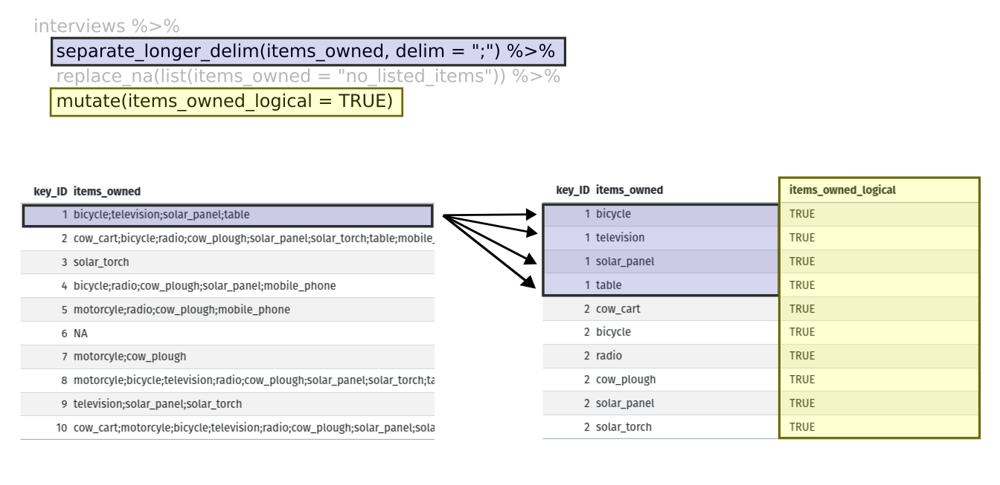

```{r setup, include=FALSE}
source("data/download_data.R")
```

::::::::::::::::::::::::::::::::::::::: objectives

- Describe the concept of a wide and a long table format and for which purpose those formats are useful.
- Describe the roles of variable names and their associated values when a table is reshaped.
- Reshape a dataframe from long to wide format and back with the `pivot_wider` and `pivot_longer` commands from the **`tidyr`** package.
- Export a dataframe to a csv file.

::::::::::::::::::::::::::::::::::::::::::::::::::

:::::::::::::::::::::::::::::::::::::::: questions

- How can I reformat a data frame to meet my needs?

::::::::::::::::::::::::::::::::::::::::::::::::::

**`dplyr`** pairs nicely with **`tidyr`** which enables you to swiftly
convert between different data formats (long vs. wide) for plotting and analysis.
To learn more about **`tidyr`** after the workshop, you may want to check out this
[handy data tidying with **`tidyr`**
cheatsheet](https://raw.githubusercontent.com/rstudio/cheatsheets/main/tidyr.pdf).

To make sure everyone will use the same dataset for this lesson, we'll read
again the SAFI dataset that we downloaded earlier.

```{r, results="hide", purl=FALSE, message=FALSE}

## load the tidyverse
library(tidyverse)
library(here)

interviews <- read_csv(here("data", "SAFI_clean.csv"), na = "NULL")

## inspect the data
interviews

## preview the data
# view(interviews)
```

## Reshaping with pivot\_wider() and pivot\_longer()

There are essentially three rules that define a "tidy" dataset:

1. Each variable has its own column
2. Each observation has its own row
3. Each value must have its own cell

This graphic visually represents the three rules that define a "tidy" dataset:


*R for Data Science*, Wickham H and Grolemund G ([https://r4ds.had.co.nz/index.html](https://r4ds.had.co.nz/index.html))
© Wickham, Grolemund 2017
This image is licenced under Attribution-NonCommercial-NoDerivs 3.0 United States (CC-BY-NC-ND 3.0 US)

In this section we will explore how these rules are linked to the different
data formats researchers are often interested in: "wide" and "long". This
tutorial will help you efficiently transform your data shape regardless of
original format. First we will explore qualities of the `interviews` data and
how they relate to these different types of data formats.

### Long and wide data formats

In the `interviews` data, each row contains the values of variables associated
with each record collected (each interview in the villages). It is stated
that the `key_ID` was "added to provide a unique Id for each observation"
and the `instanceID` "does this as well but it is not as convenient to use."

Once we have established that `key_ID` and `instanceID` are both unique we can use 
either variable as an identifier corresponding to the 131 interview records.

```{r, purl=FALSE}
interviews %>% 
  select(key_ID) %>% 
  distinct() %>% 
  count()
```

```{r, purl=FALSE}
interviews %>% 
  select(instanceID) %>% 
  distinct() %>% 
  count()
```

As seen in the code below, for each interview date in each village no
`instanceID`s are the same. Thus, this format is what is called a "long" data
format, where each observation occupies only one row in the dataframe.

```{r, purl=FALSE}
interviews %>%
  filter(village == "Chirodzo") %>%
  select(key_ID, village, interview_date, instanceID) %>%
  sample_n(size = 10)
```

We notice that the layout or format of the `interviews` data is in a format that
adheres to rules 1-3, where

- each column is a variable
- each row is an observation
- each value has its own cell

This is called a "long" data format. But, we notice that each column represents
a different variable. In the "longest" data format there would only be three
columns, one for the id variable, one for the observed variable, and one for the
observed value (of that variable). This data format is quite unsightly
and difficult to work with, so you will rarely see it in use.

Alternatively, in a "wide" data format we see modifications to rule 1, where
each column no longer represents a single variable. Instead, columns can
represent different levels/values of a variable. For instance, in some data you
encounter the researchers may have chosen for every survey date to be a
different column.

These may sound like dramatically different data layouts, but there are some
tools that make transitions between these layouts much simpler than you might
think! The gif below shows how these two formats relate to each other, and
gives you an idea of how we can use R to shift from one format to the other.


Long and wide dataframe layouts mainly affect readability. You may find that
visually you may prefer the "wide" format, since you can see more of the data on
the screen. However, all of the R functions we have used thus far expect for
your data to be in a "long" data format. This is because the long format is more
machine readable and is closer to the formatting of databases.

### Questions which warrant different data formats

In interviews, each row contains the values of variables associated with each
record (the unit), values such as the village of the respondent, the number
of household members, or the type of wall their house had. This format allows
for us to make comparisons across individual surveys, but what if we wanted to
look at differences in households grouped by different types of items owned?

To facilitate this comparison we would need to create a new table where each row
(the unit) was comprised of values of variables associated with items owned
(i.e., `items_owned`). In practical terms this means the values of
the items in `items_owned` (e.g. bicycle,
radio, table, etc.) would become the names of column variables and
the cells would contain values of `TRUE` or `FALSE`, for whether that household
had that item.

Once we we've created this new table, we can explore the relationship within and
between villages. The key point here is that we are still following a tidy data
structure, but we have **reshaped** the data according to the observations of
interest.

Alternatively, if the interview dates were spread across multiple columns, and
we were interested in visualizing, within each village, how irrigation
conflicts have changed over time. This would require for the interview date to
be included in a single column rather than spread across multiple columns. Thus,
we would need to transform the column names into values of a variable.

We can do both of these transformations with two `tidyr` functions,
`pivot_wider()` and `pivot_longer()`.

## Pivoting wider

`pivot_wider()` takes three principal arguments:

1. the data
2. the *names\_from* column variable whose values will become new column names.
3. the *values\_from* column variable whose values will fill the new column
  variables.

Further arguments include `values_fill` which, if set, fills in missing values
with the value provided.

Let's use `pivot_wider()` to transform interviews to create new columns for each
item owned by a household.
There are a couple of new concepts in this transformation, so let's walk through
it line by line. First we create a new object (`interviews_items_owned`) based on
the `interviews` data frame.

```{r, eval=FALSE}
interviews_items_owned <- interviews %>%
```

Then we will actually need to make our data frame longer, because we have 
multiple items in a single cell.
We will use a new function, `separate_longer_delim()`, from the **`tidyr`** package
to separate the values of `items_owned` based on the presence of semi-colons (`;`).
The values of this variable were multiple items separated by semi-colons, so
this action creates a row for each item listed in a household's possession.
Thus, we end up with a long format version of the dataset, with multiple rows
for each respondent. For example, if a respondent has a television and a solar
panel, that respondent will now have two rows, one with "television" and the
other with "solar panel" in the `items_owned` column.

```{r, eval=FALSE}
separate_longer_delim(items_owned, delim = ";") %>%
```

After this transformation, you may notice that the `items_owned` column contains
`NA` values. This is because some of the respondents did not own any of the items
in the interviewer's list. We can use the `replace_na()` function to
change these `NA` values to something more meaningful. The `replace_na()` function
expects for you to give it a `list()` of columns that you would like to replace
the `NA` values in, and the value that you would like to replace the `NA`s. This
ends up looking like this:

```{r, eval=FALSE}
replace_na(list(items_owned = "no_listed_items")) %>%
```

Next, we create a new variable named `items_owned_logical`, which has one value
(`TRUE`) for every row. This makes sense, since each item in every row was owned
by that household. We are constructing this variable so that when we spread the
`items_owned` across multiple columns, we can fill the values of those columns
with logical values describing whether the household did (`TRUE`) or did not
(`FALSE`) own that particular item.

```{r, eval=FALSE}
mutate(items_owned_logical = TRUE) %>%
```

{alt="Two tables shown side-by-side. The first row
of the left table is highlighted in blue, and the first four rows of the right
table are also highlighted in blue to show how each of the values of 'items
owned' are given their own row with the separate longer delim function. The
'items owned logical' column is highlighted in yellow on the right table to show
how the mutate function adds a new column."}

At this point, we can also count the number of items owned by each household,
which is equivalent to the number of rows per `key_ID`. We can do this with a
`group_by()` and `mutate()` pipeline that works similar to `group_by()` and
`summarize()` discussed in the previous episode but instead of creating a
summary table, we will add another column called `number_items`. We use the
`n()` function to count the number of rows within each group. However, there is
one difficulty we need to take into account, namely those households that did
not list any items. These households now have `"no_listed_items"` under
`items_owned`. We do not want to count this as an item but instead show zero
items. We can accomplish this using **`dplyr`'s** `if_else()` function that
evaluates a condition and returns one value if true and another if false. Here,
if the `items_owned` column is `"no_listed_items"`, then a 0 is returned,
otherwise, the number of rows per group is returned using `n()`.

```{r, eval=FALSE}
group_by(key_ID) %>% 
  mutate(number_items = if_else(items_owned == "no_listed_items", 0, n())) %>% 

```

Lastly, we use `pivot_wider()` to switch from long format to wide format. This
creates a new column for each of the unique values in the `items_owned` column,
and fills those columns with the values of `items_owned_logical`. We also
declare that for items that are missing, we want to fill those cells with the
value of `FALSE` instead of `NA`.

```{r, eval=FALSE}
pivot_wider(names_from = items_owned,
            values_from = items_owned_logical,
            values_fill = list(items_owned_logical = FALSE))

```

{alt="Two tables shown side-by-side. The 'items owned'
column is highlighted in blue on the left table, and the column names are
highlighted in blue on the right table to show how the values of the 'items
owned' become the column names in the output of the pivot wider function. The
'items owned logical' column is highlighted in yellow on the left table, and the
values of the bicycle, television, and solar panel columns are highlighted in
yellow on the right table to show how the values of the 'items owned logical'
column became the values of all three of the aforementioned columns."}

Combining the above steps, the chunk looks like this. Note that two new columns
are created within the same `mutate()` call.

```{r}
interviews_items_owned <- interviews %>%
  separate_longer_delim(items_owned, delim = ";") %>%
  replace_na(list(items_owned = "no_listed_items")) %>%
  group_by(key_ID) %>%
  mutate(items_owned_logical = TRUE,
         number_items = if_else(items_owned == "no_listed_items", 0, n())) %>%
  pivot_wider(names_from = items_owned,
              values_from = items_owned_logical,
              values_fill = list(items_owned_logical = FALSE))
```

View the `interviews_items_owned` data frame. It should have `r
nrow(interviews)` rows (the same number of rows you had originally), but extra
columns for each item. How many columns were added? Notice that there is no
longer a column titled `items_owned`. This is because there is a default
parameter in `pivot_wider()` that drops the original column. The values that
were in that column have now become columns named `television`, `solar_panel`,
`table`, etc. You can use `dim(interviews)` and `dim(interviews_wide)` to see
how the number of columns has changed between the two datasets.

This format of the data allows us to do interesting things, like make a table
showing the number of respondents in each village who owned a particular item:

```{r, purl=FALSE}
interviews_items_owned %>%
  filter(bicycle) %>%
  group_by(village) %>%
  count(bicycle)
```

Or below we calculate the average number of items from the list owned by
respondents in each village using the `number_items` column we created to
count the items listed by each household.

```{r, purl=FALSE}
interviews_items_owned %>%
    group_by(village) %>%
    summarize(mean_items = mean(number_items))
```

:::::::::::::::::::::::::::::::::::::::  challenge

## Exercise

We created `interviews_items_owned` by reshaping the data: first longer and then
wider. Replicate this process with the `months_lack_food` column in the
`interviews` dataframe. Create a new dataframe with columns for each of the
months filled with logical vectors (`TRUE` or `FALSE`) and a summary column
called `number_months_lack_food` that calculates the number of months each
household reported a lack of food.

Note that if the household did not lack food in the previous 12 months, the
value input was "none".

:::::::::::::::  solution

## Solution

```{r}
months_lack_food <- interviews %>%
  separate_longer_delim(months_lack_food, delim = ";") %>%
  group_by(key_ID) %>%
  mutate(months_lack_food_logical = TRUE,
         number_months_lack_food = if_else(months_lack_food == "none", 0, n())) %>%
  pivot_wider(names_from = months_lack_food,
              values_from = months_lack_food_logical,
              values_fill = list(months_lack_food_logical = FALSE))
```

:::::::::::::::::::::::::


::::::::::::::::::::::::::::::::::::::::::::::::::

## Pivoting longer

The opposing situation could occur if we had been provided with data in the form
of `interviews_wide`, where the items owned are column names, but we
wish to treat them as values of an `items_owned` variable instead.

In this situation we are gathering these columns turning them into a pair
of new variables. One variable includes the column names as values, and the
other variable contains the values in each cell previously associated with the
column names. We will do this in two steps to make this process a bit clearer.

`pivot_longer()` takes four principal arguments:

1. the data
2. *cols* are the names of the columns we use to fill the a new values variable
  (or to drop).
3. the *names\_to* column variable we wish to create from the *cols* provided.
4. the *values\_to* column variable we wish to create and fill with values
  associated with the *cols* provided.


```{r, purl=FALSE}
interviews_long <- interviews_items_owned %>%
  pivot_longer(cols = bicycle:car,
               names_to = "items_owned",
               values_to = "items_owned_logical")
```

View both `interviews_long` and `interviews_items_owned` and compare their structure.

:::::::::::::::::::::::::::::::::::::::  challenge

## Exercise

We created some summary tables on `interviews_items_owned` using `count` and
`summarise`. We can create the same tables on `interviews_long`, but this will
require a different process.

Make a table showing the number of respondents in each village who owned
a particular item, and include all items. The difference between this format and
the wide format is that you can now `count` all the items using the
`items_owned` variable.

:::::::::::::::  solution

## Solution

```{r}
interviews_long %>%
  filter(items_owned_logical) %>% 
  group_by(village) %>% 
  count(items_owned)
```

:::::::::::::::::::::::::


::::::::::::::::::::::::::::::::::::::::::::::::::


## Applying what we learned to clean our data

Now we have simultaneously learned about `pivot_longer()` and `pivot_wider()`,
and fixed a problem in the way our data is structured. In this dataset, we have
another column that stores multiple values in a single cell. Some of the cells
in the `months_lack_food` column contain multiple months which, as before, are
separated by semi-colons (`;`).

To create a data frame where each of the columns contain only one value per cell,
we can repeat the steps we applied to `items_owned` and apply them to
`months_lack_food`. Since we will be using this data frame for the next episode,
we will call it `interviews_plotting`.

```{r, purl=FALSE}
## Plotting data ##
interviews_plotting <- interviews %>%
  ## pivot wider by items_owned
  separate_longer_delim(items_owned, delim = ";") %>%
  replace_na(list(items_owned = "no_listed_items")) %>%
  ## Use of grouped mutate to find number of rows
  group_by(key_ID) %>% 
  mutate(items_owned_logical = TRUE,
         number_items = if_else(items_owned == "no_listed_items", 0, n())) %>% 
  pivot_wider(names_from = items_owned,
              values_from = items_owned_logical,
              values_fill = list(items_owned_logical = FALSE)) %>% 
  ## pivot wider by months_lack_food
  separate_longer_delim(months_lack_food, delim = ";") %>%
  mutate(months_lack_food_logical = TRUE,
         number_months_lack_food = if_else(months_lack_food == "none", 0, n())) %>%
  pivot_wider(names_from = months_lack_food,
              values_from = months_lack_food_logical,
              values_fill = list(months_lack_food_logical = FALSE))

```


## Exporting data

Now that you have learned how to use **`dplyr`** and **`tidyr`** to wrangle your
raw data, you may want to export these new datasets to share them with your
collaborators or for archival purposes.

Similar to the `read_csv()` function used for reading CSV files into R, there is
a `write_csv()` function that generates CSV files from data frames.

Before using `write_csv()`, we are going to create a new folder, `data_output`,
in our working directory that will store this generated dataset. We don't want
to write generated datasets in the same directory as our raw data. It's good
practice to keep them separate. The `data` folder should only contain the raw,
unaltered data, and should be left alone to make sure we don't delete or modify
it. In contrast, our script will generate the contents of the `data_output`
directory, so even if the files it contains are deleted, we can always
re-generate them.

In preparation for our next lesson on plotting, we created a version of the
dataset where each of the columns includes only one data value. Now we can save
this data frame to our `data_output` directory.

```{r, purl=FALSE, eval=FALSE}
write_csv(interviews_plotting, file = "data_output/interviews_plotting.csv")
```

```{r, purl=FALSE, eval=TRUE, echo=FALSE}
if (!dir.exists("data_output")) dir.create("data_output")
write_csv(interviews_plotting, "data_output/interviews_plotting.csv")
```

:::::::::::::::::::::::::::::::::::::::: keypoints

- Use the `tidyr` package to change the layout of data frames.
- Use `pivot_wider()` to go from long to wide format.
- Use `pivot_longer()` to go from wide to long format.

::::::::::::::::::::::::::::::::::::::::::::::::::

